# Infrastructure Architecture Diagrams

This document provides comprehensive visual documentation of the talos-homelab cluster architecture using Mermaid diagrams.

## Table of Contents

1. [High-Level System Overview](#high-level-system-overview)
2. [Network Topology](#network-topology)
3. [Network Layer Stack](#network-layer-stack)
4. [Kubernetes Architecture](#kubernetes-architecture)
5. [GitOps Workflow](#gitops-workflow)
6. [Storage Architecture](#storage-architecture)
7. [Observability Stack](#observability-stack)
8. [Service Mesh Integration](#service-mesh-integration)

---

## High-Level System Overview

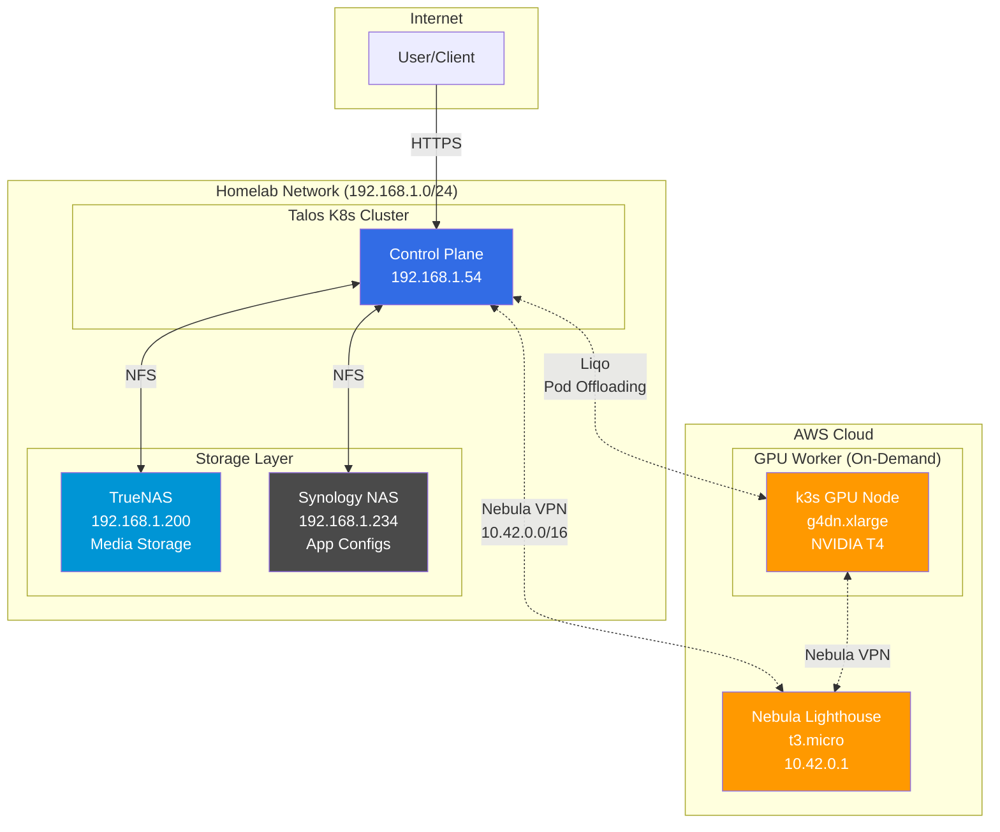

---

## Network Topology

### Physical + Overlay Network

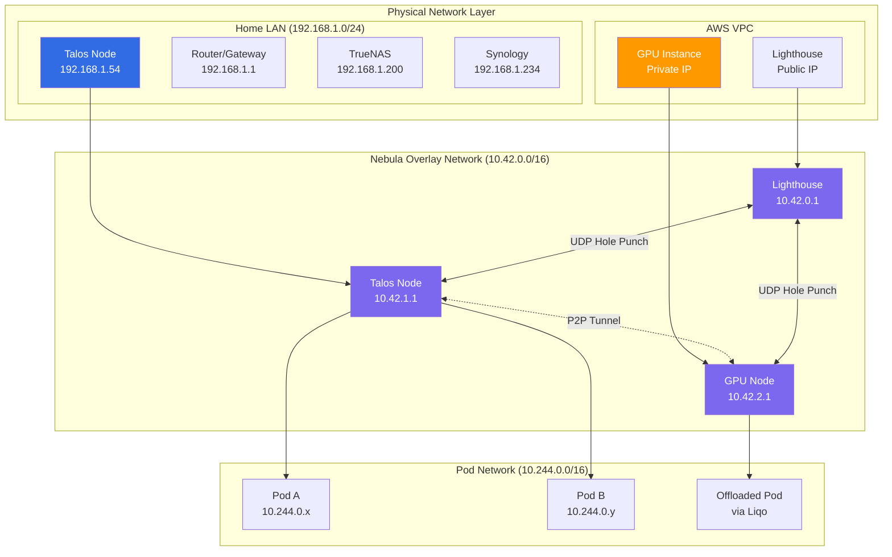

---

## Network Layer Stack

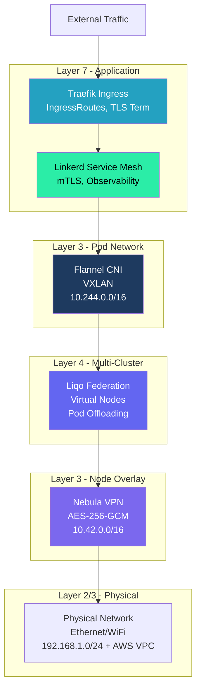

### Network Layer Details

| Layer        | Component | CIDR/Protocol   | Purpose                                                             |
| ------------ | --------- | --------------- | ------------------------------------------------------------------- |
| L7 (Mesh)    | Linkerd   | mTLS            | Service-to-service encryption, observability (active on scratch ns) |
| L7 (Ingress) | Traefik   | HTTP/HTTPS      | External access, routing, TLS termination                           |
| L4-L7        | Liqo      | Virtual Kubelet | Multi-cluster federation, pod offloading                            |
| L3 (Pod)     | Flannel   | 10.244.0.0/16   | Intra-cluster pod networking                                        |
| L3 (Overlay) | Nebula    | 10.42.0.0/16    | Encrypted inter-node tunnels                                        |
| L2-L3        | Physical  | 192.168.1.0/24  | Home network                                                        |

---

## Kubernetes Architecture

### Cluster Components

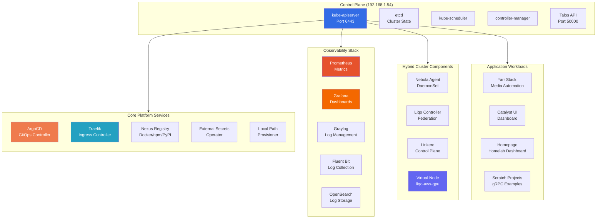

### Namespace Organization

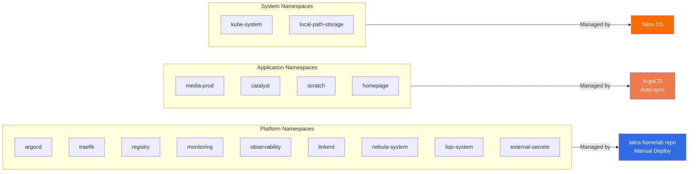

---

## GitOps Workflow

### Dual GitOps Pattern

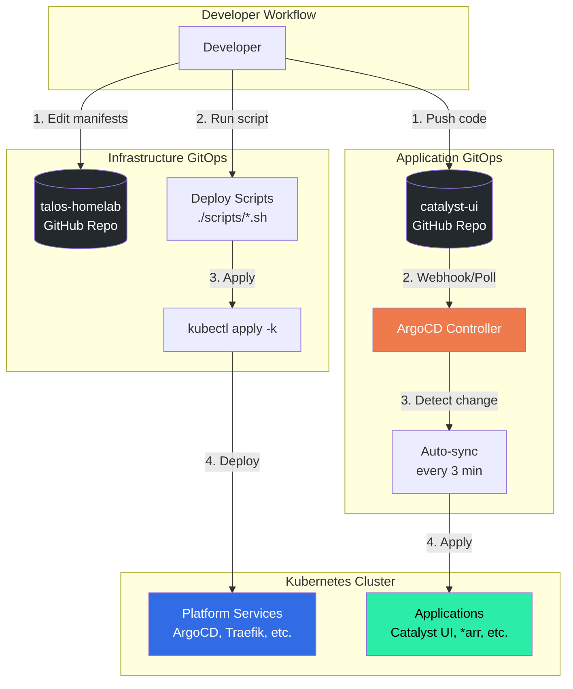

### Infrastructure Deployment Flow

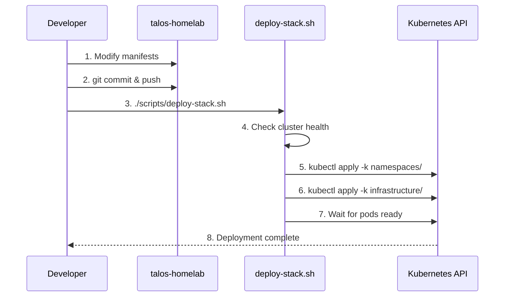

### Application Deployment Flow

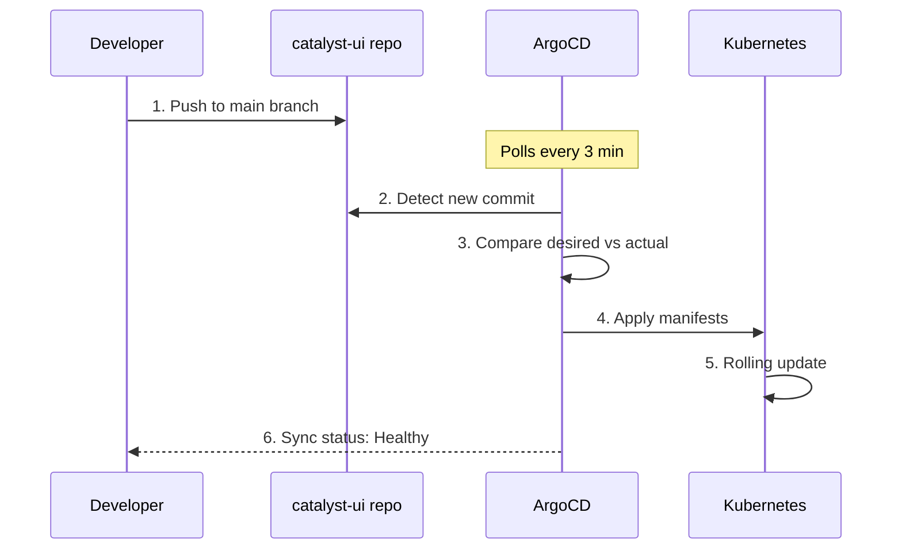

---

## Storage Architecture

### Storage Topology

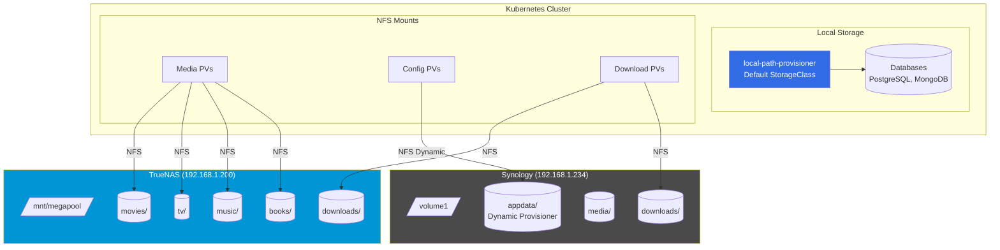

### Storage Classes

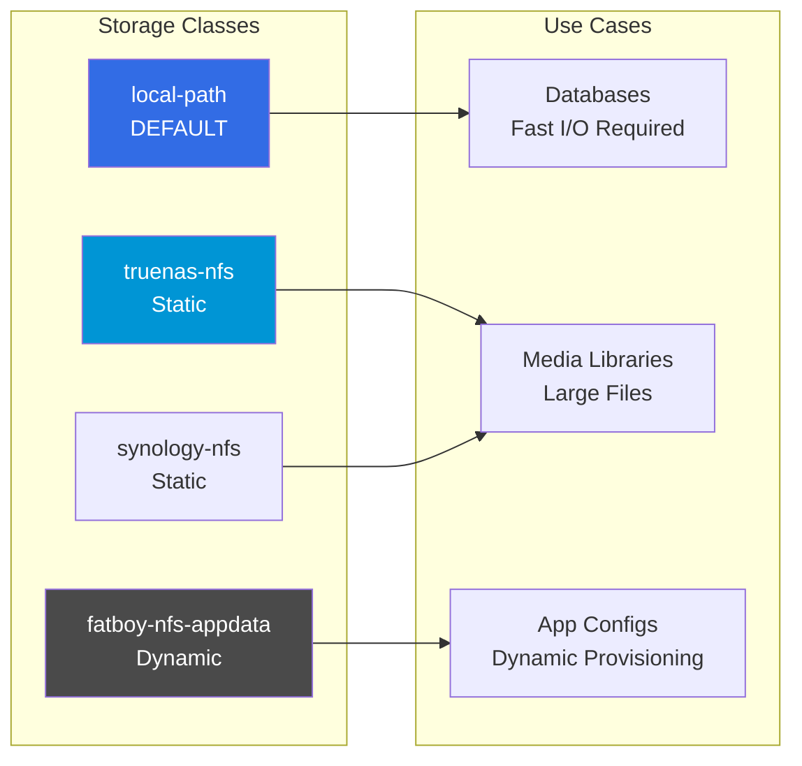

---

## Observability Stack

### Monitoring & Logging Architecture

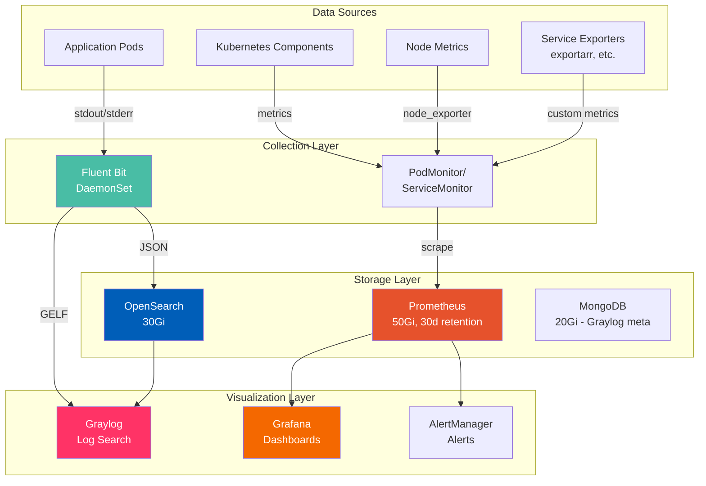

### Metrics Flow

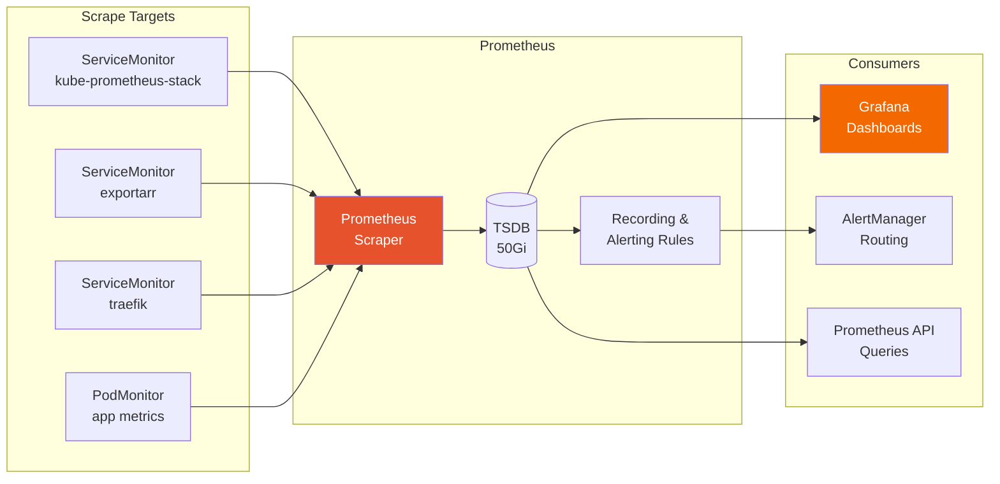

---

## Service Mesh Integration

### Linkerd + Nebula + Liqo Stack

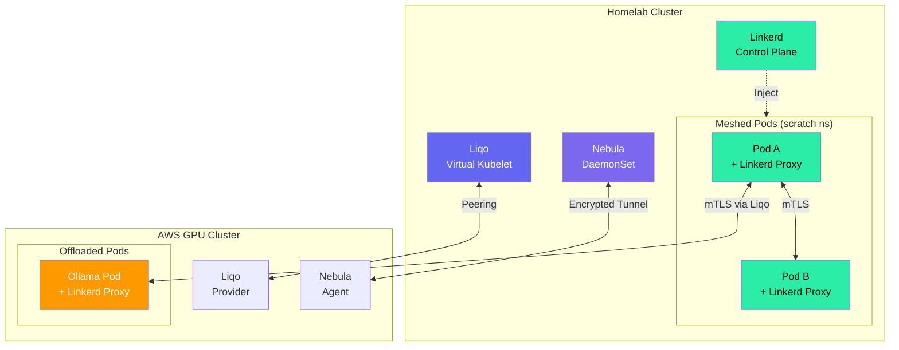

### Security Layers

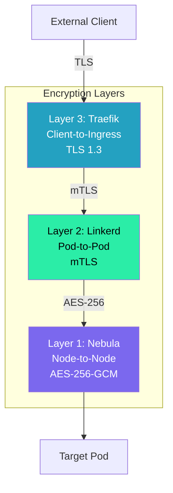

---

## Quick Reference

### Key IPs and Ports

| Service         | Address       | Port     |
| --------------- | ------------- | -------- |
| Talos API       | 192.168.1.54  | 50000    |
| Kubernetes API  | 192.168.1.54  | 6443     |
| Nebula Overlay  | 10.42.x.x     | UDP 4242 |
| Pod Network     | 10.244.x.x    | -        |
| Service Network | 10.96.x.x     | -        |
| TrueNAS NFS     | 192.168.1.200 | 2049     |
| Synology NFS    | 192.168.1.234 | 2049     |

### Service URLs

| Service    | URL                          |
| ---------- | ---------------------------- |
| ArgoCD     | http://argocd.talos00        |
| Grafana    | http://grafana.talos00       |
| Prometheus | http://prometheus.talos00    |
| Graylog    | http://graylog.talos00       |
| Nexus      | http://nexus.talos00         |
| Registry   | http://registry.talos00:5000 |
| Homepage   | http://homepage.talos00      |

---

**Last Updated**: 2025-11-30
**Maintained By**: Infrastructure Team
