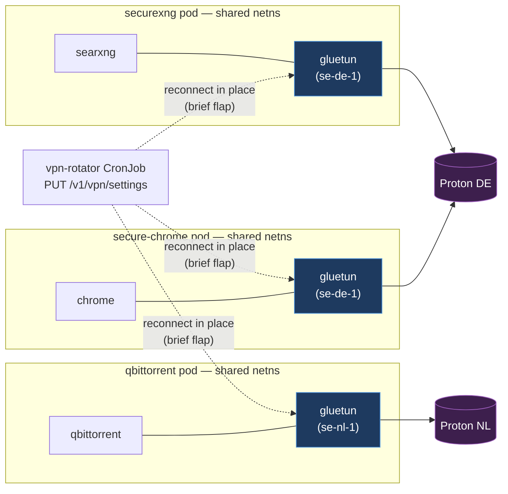
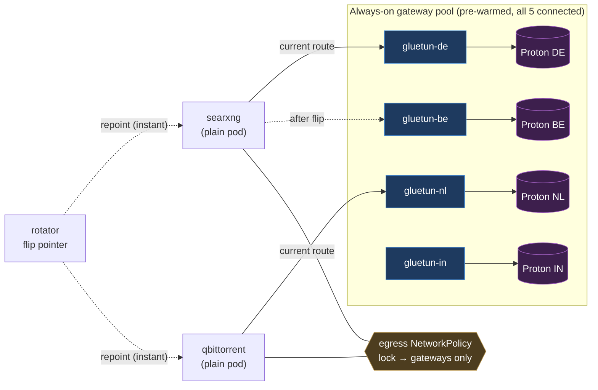

# VPN Egress Rotation — Architecture Comparison

> Spike: **TALOS-yy8** · Related: **TALOS-1ms** (native sidecars), **TALOS-4qwy** (stale-route crashloop)

## TL;DR

Two ways to give containers rotatable VPN egress:

- **A — Inline sidecar (current):** every consumer pod carries its **own** gluetun sidecar in the shared
  netns. Rotation = the rotator `PUT`s the gluetun control API and it **reconnects in place** (brief
  tunnel flap).
- **B — Pre-warmed gateway pool (proposed):** run **N always-on** gluetun egress gateways (one per
  server/country), and consumers **flip which gateway they route through**. Rotation is an instant
  pointer swap — no tunnel setup, no reconnect flap.

**B buys zero-downtime rotation at the cost of a bigger leak surface** (the app pod no longer owns a
kill-switch) **and a hard cap of 4 concurrent exits** (= number of ProtonVPN keys we hold). Recommended
path: keep **A** for leak-sensitive apps (qbittorrent), spike **B (proxy variant)** for proxy-capable,
frequently-rotated apps (searxng/scrapers) behind a strict egress `NetworkPolicy`.

---

## A — Inline sidecar, rotate-in-place (current)

Each consumer pod = `app + gluetun` sharing one netns. `vpn-rotator` (CronJob, `*/35`) `PUT`s
`/v1/vpn/settings` on each `rotation=enabled` gluetun, which tears down and re-dials a new server.

**Kill-switch:** gluetun's firewall lives in the **same netns** as the app — the app *physically cannot*
egress except through the tunnel. No `NetworkPolicy` required.

---

## B — Pre-warmed egress-gateway pool, flip the route (proposed)

N standalone gluetun **gateway** pods, each permanently connected to a different server, each behind a
stable Service (HTTP `:8888` / SOCKS `:1080`). Consumers carry **no gluetun**; they route egress through
**one** gateway. Rotation = repoint the consumer (proxy URL / Service selector / default route) to a
different, already-connected gateway.

**Kill-switch moves to the app:** the plain app pod has no VPN firewall of its own. If routing to the
gateway breaks and egress isn't hard-locked, it **falls back to cluster/home egress = leak**. Every
consumer must be `NetworkPolicy`-locked to *only* the gateway Services (+ DNS).

**Flip mechanisms (pick one):**

| Variant | How the flip works | Works for | Caveat |
|---|---|---|---|
| **Proxy-pointer** | change the app's `HTTP(S)_PROXY` / SOCKS URL (or a Service selector) | apps that honor a proxy (searxng, qbit, scrapers) | DNS may bypass the proxy → DNS leak; app must support proxies |
| **L3 route-swap** | swap the default route in the app netns (policy routing / routing sidecar w/ `NET_ADMIN`) | *any* app | fiddly; live route swap still resets in-flight connections |

---

## Pros / cons

### A — Inline sidecar (current)

| Pros | Cons |
|---|---|
| Dead-simple: 1 pod = 1 tunnel = 1 app, no cross-pod routing | **Rotation flaps the tunnel** (seconds of egress downtime) — the thing we want to kill |
| **Strongest kill-switch** — firewall in the app's own netns, no `NetworkPolicy` needed | Resource duplication: a gluetun per app (CPU/mem × N) |
| Blast radius = one app | Every app pod needs `NET_ADMIN` + privileged |
| No extra ProtonVPN connections beyond what's used | Stale-route (`table 51820`) crashloop risk lives in **every** app pod (TALOS-4qwy) |
| Ecosystem-blessed, already battle-tested here | App startup coupled to its gluetun init each deploy |

### B — Pre-warmed gateway pool (proposed)

| Pros | Cons |
|---|---|
| **Zero-setup rotation** — gateways already up; flip is instant for new connections | **Leak surface moves to the app** — no per-app kill-switch; requires strict egress `NetworkPolicy` or it leaks on gateway loss |
| App pods become plain (no gluetun, no `NET_ADMIN`, no stale-route risk) | **Hard cap = 4 concurrent exits** (= # ProtonVPN keys: nl/de/be/in); can't pre-warm more routes than keys allow |
| Resource-efficient at scale: 4 shared gateways vs 1-per-app | Flip mechanism complexity (proxy-support gaps *or* L3 policy-routing) |
| Trivial failover: gateway dies → flip to another already-up gateway | Long-lived connections still reset on flip (exit IP changes) |
| Instant "menu" of exit locations any app can pick | More moving parts (N Deployments + Services + NetworkPolicies + flip controller); 4 tunnels always up even when idle |

---

## Recommendation

- **Don't wholesale-replace A.** Its in-netns kill-switch is the strongest leak guarantee we have, and for
  **qbittorrent** (torrent traffic must never touch the home WAN) that guarantee is worth keeping.
- **Spike B in the proxy variant** for apps that (a) honor a proxy and (b) rotate often / want instant
  location switching (searxng, scrapers). Gate it behind a strict egress `NetworkPolicy` (gateways + DNS
  only) and a **health-gated flip** (only ever flip to a gateway validated `running` with a real exit IP).
- **Respect the 4-key ceiling:** B tops out at a 4-country menu today; scaling the pool means more
  ProtonVPN keys/plan headroom.
- **Hybrid is the likely end state:** leak-sensitive apps stay on A; a small pre-warmed pool serves the
  rotation-happy, proxy-capable apps.

### DR-test implications

- Under **B** the kill-switch test changes shape: it becomes (1) a per-gateway kill-switch test **plus**
  (2) a consumer **egress-lock** test (kill the gateway, assert the app egress goes to *nothing*, never
  home WAN — the `NetworkPolicy` is doing the work now).
- Rotation under **B** is a "pointer-flip" test: assert new connections exit the new gateway and the app
  pod is untouched (which B satisfies trivially — the app never runs gluetun).

---

## Related Issues

- **TALOS-yy8** — SPIKE: pre-warmed egress-gateway pool + route/proxy flip
- **TALOS-1ms** — Migrate gluetun sidecars to K8s native sidecars (1.28+)
- **TALOS-4qwy** — stale WireGuard `table 51820` crashloop (root cause)
