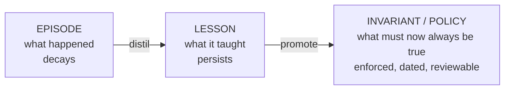
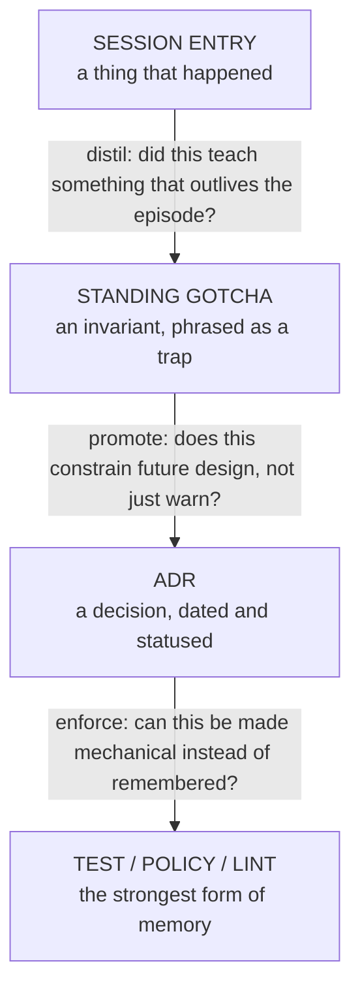

# Memory & Knowledge Architecture

## TL;DR

We do not have a memory problem. We have a **routing** problem.

Ten stores already hold project knowledge. Nothing decides which store a given fact belongs
in, so the same fact lands in three of them and rots at three different rates. The fix is not
another store — it is a **taxonomy, a promotion ladder, and a retention policy**.

The spine of the design:



ADRs are the top of that ladder. A lesson that constrains future design is not a note — it is
a decision, and it should be dated, statused and challengeable.

---

## 1. The actual problem

An honest inventory of where knowledge currently lives in this project:

| #   | Store                                        | Holds                                 | Rots?                                                         |
| --- | -------------------------------------------- | ------------------------------------- | ------------------------------------------------------------- |
| 1   | `SESSION_STATUS.md`                          | session log, ticket ledger            | by design (archives)                                          |
| 2   | one-off `handoff-*.md` state dumps           | a session's state, frozen at its date | **badly** — none remain; see §6                               |
| 3   | `ADR-NNN-*.md` under `docs/02-architecture/` | decisions                             | no (dated + statused) — **but the tree currently holds none** |
| 4   | `postmortems/*.md`                           | incident narratives                   | no — **none currently in the tree**                           |
| 5   | `bd remember`                                | gotchas, operational facts            | silently                                                      |
| 6   | `~/.claude/.../memory/` + `MEMORY.md`        | cross-session agent memory            | silently                                                      |
| 7   | memory-service (MCP)                         | semantic recall, consolidation        | decays by design                                              |
| 8   | codebase-memory (MCP)                        | code graph, `manage_adr`              | regenerable                                                   |
| 9   | claude-context (MCP)                         | vector search over code               | regenerable                                                   |
| 10  | In-file comments + `CLAUDE.md`               | constraints at point of use           | **badly**                                                     |

Three failure modes follow directly, and all three were observed on 2026-09-18:

- **Duplication without authority.** The CrowdSec GC parent/child behaviour is documented in a
  values file comment, a commit message, and a beads ticket. Three copies, no owner. When one
  turned out to be wrong about the mechanism, the other two kept asserting it.
- **Live state written where invariants belong.** `security/README.md` claimed a CronJob "is
  currently failing". It was healthy within a day — in a document read _precisely when
  something else is broken_.
- **Lessons trapped at point of use.** "Verify the outcome, not the field you changed" existed
  only as a comment inside one YAML file. It could not be recalled, searched, or applied to the
  next component, so the same class of bug recurred three times in 24 hours.

> The system is not short of memory. It is short of **retrieval under the right conditions**.

---

## 2. Taxonomy: four kinds of knowledge

Route by asking **"when would someone need this, and does it expire?"**

### Episodic — _what happened_

Sessions, incidents, migrations. Has a date and a subject. **Expires as fact, survives as
narrative.** Cheap to archive, expensive to lose entirely.
→ `SESSION_STATUS.md` → `docs/session-archive.md`, plus postmortems for incidents.

### Semantic — _what we learned_

Gotchas, sharp edges, surprising behaviours. Not tied to a date. **"X looks like Y but is
actually Z."** This is the layer that was most badly served before now.
→ Standing gotchas in `SESSION_STATUS.md`, promoted from episodes; mirrored to `bd remember`
for recall.

### Normative — _what must be true_

Decisions, constraints, policy. **ADRs.** Distinguished from a lesson by _obligation_: a lesson
tells you what bit someone, an ADR tells you what you may no longer do.
→ `docs/02-architecture/ADR-NNN-*.md`.

### Derived — _what the code says_

Call graphs, embeddings, resource inventories. **Regenerable, never authored.** If it
disagrees with reality, reindex — do not edit.
→ codebase-memory, claude-context. Never hand-maintained.

**The routing rule:** every fact has exactly **one** authoritative home. Other stores may
_point_ at it; they may not _restate_ it. Duplication is how a system starts lying to itself.

---

## 3. The promotion ladder

The core mechanic. Knowledge moves **up** as it proves durable, and episodes are allowed to
decay once they have paid out.



Each step is a demotion of how much a human must remember. **The terminal state of a good
lesson is a test, not a note.**

Worked example from 2026-09-18:

1. **Episode** — the honeypot tripwire was blind three times; each fix verified the field it
   had just changed.
2. **Gotcha** — _"Never verify a detection control by checking an intermediate field. A 12-hex
   container ID is a broken state and is not null."_
3. **ADR candidate** — _"Detection controls must be verified end to end, by firing the rule."_
   Constrains all future detection work, not just Falco.
4. **Enforcement** — the `falco-tripwire-canary` CronJob and `HoneypotTripwireNotFiring` alert.
   Now nobody has to remember it.

Step 4 is what makes this real. A gotcha list that only grows is a backlog of things you are
expected to keep in your head.

---

## 4. ADRs as the policy layer

The user insight this document is built around: **ADRs are invariants with authority.**

The tree currently holds **no ADRs at all**. There was one — `ADR-001-power-resilience`, still
`PROPOSED` months after it was written — and it was archived along with the rest of
`docs/_archive/` without ever being accepted or closed. A decision record nobody maintained was
indistinguishable from an old document, so it was pruned as one. That is the strongest possible
evidence for this section: an unmaintained policy layer does not survive a cleanup.

**Write an ADR when a decision:**

- constrains future work (_"never X"_, _"always Y"_),
- cost something real to learn,
- someone will otherwise plausibly reverse without knowing why.

**Do not write one** for a fact, a preference, or a thing already enforced by a test.

**Minimum shape** (matching ADR-001):

```markdown
# ADR-NNN: <decision, stated as a rule>

**Date:** · **Status:** PROPOSED | ACCEPTED | SUPERSEDED-BY-NNN · **Related:** <tickets>

## Context — what forced the decision, with evidence

## Decision — the rule, imperative voice

## Consequences — what this costs, and what it forecloses
```

Three rules keep them honest:

- **Status must be maintained.** A permanently-`PROPOSED` ADR is not policy; it is an opinion
  with formatting. Either accept it or close it.
- **Supersede, never edit.** ADR-007 replaces ADR-003; ADR-003 stays, marked superseded. The
  reasoning trail _is_ the value.
- **An ADR that no test enforces is an aspiration.** Note the enforcing test in Consequences,
  or explain why it cannot be mechanised.

Candidate ADRs from today's work, in priority order:

1. **Detection controls are verified end to end** — fire the rule, observe the alert. Never
   assert on an intermediate field.
2. **Chart values are schema-validated in CI** — `kustomize build` is not validation. (`TALOS-cp18`)
3. **Docs record decisions, never live health** — health belongs in alerts.
4. **Enforcement-path changes are one concern per commit, verified before the next** — the two
   worst outages of 2026-09-18 were optional tidying bundled mid-campaign.

---

## 5. Retention and consolidation ("dreaming")

Borrowed from the memory-service model already running locally: recent memory is
high-fidelity, older memory is compressed but not discarded, and **consolidation extracts
meaning before detail is dropped**.

| Tier      | Window           | Fidelity              | Where                                          |
| --------- | ---------------- | --------------------- | ---------------------------------------------- |
| Hot       | current session  | full                  | working context, `SESSION_STATUS.md` top entry |
| Warm      | last 10 sessions | entry + ticket ledger | `SESSION_STATUS.md`                            |
| Cold      | older            | entry, unedited       | `docs/session-archive.md`                      |
| Distilled | timeless         | invariant only        | Standing gotchas → ADRs                        |

**The consolidation step is the one that must not be skipped.** Before an entry ages out of the
index, ask: _did this teach anything that outlives it?_ If yes, promote the lesson first. That
is the difference between a knowledge base and a diary — and it is the step a human will skip
under time pressure, which is why `/closeout-session` performs it explicitly.

---

## 6. Where this is now, and what is next

**Shipped (MVP):**

- `SESSION_STATUS.md` — episodic index with per-session ticket ledger, 10-entry retention.
- `docs/session-archive.md` — cold tier.
- `/closeout-session` — user-level command; derives the entry from git and the tracker, rolls
  the index, and performs distillation before archiving.
- Standing gotchas in `SESSION_STATUS.md`, seeded from 2026-09-18 and grown since.

**Next, in order:**

1. ~~**Retire the one-off handoff docs.**~~ Done — `handoff-2026-08-24.md` and every other
   `handoff-*.md` were archived and then removed. `SESSION_STATUS.md` supersedes them; do not
   write more.
2. **Write the first two ADRs** (end-to-end verification; schema validation in CI) and move
   ADR-001 out of `PROPOSED`. Without this, the policy layer stays theoretical.
3. **Resolve the gotcha/`bd remember` overlap.** Both hold semantic knowledge; pick the
   authority. Proposal: `SESSION_STATUS.md` is human-facing and curated, `bd remember` is the
   queryable mirror, and the closeout command writes both from one source.
4. **Bootstrap a sibling repo** — the cross-repo scan is the main justification for the header
   shape and is currently untested with n=1.
5. **Only then** consider automation: promotion suggestions, staleness detection, cross-repo
   rollup. Premature tooling on an unproven taxonomy just makes the wrong shape harder to change.

---

## 7. Open questions

Recorded rather than resolved; revisit once there is usage data.

- **Retention of 10 is a guess.** Depends on whether the file is read per-repo or across repos.
  Cross-repo reading argues for shorter entries and faster archiving.
- **Do gotchas need scope?** Some are repo-specific ("the honeypot ns blocks the apiserver"),
  some are universal ("`kustomize build` is not schema validation"). Universal ones arguably
  belong in `~/.claude/CLAUDE.md`, not here — but that store has no review process.
- **What expires a gotcha?** Nothing currently removes one when the underlying trap is fixed.
  A stale warning costs attention every time it is read.
- **Is `bd remember` load-bearing or incidental?** Entries exist; it is unclear how often they
  are actually recalled at the moment of need, which is the only test that matters.
- **Does the promotion ladder survive contact with a second repo**, or is it shaped by this
  one's unusually incident-heavy history?

---

## Related Issues

- `TALOS-a13n` — resume epic; consumer of this structure
- `TALOS-cp18` — schema validation in CI (ADR candidate #2)
- `TALOS-kb2f` — end-to-end detection test (enforcement for ADR candidate #1)
