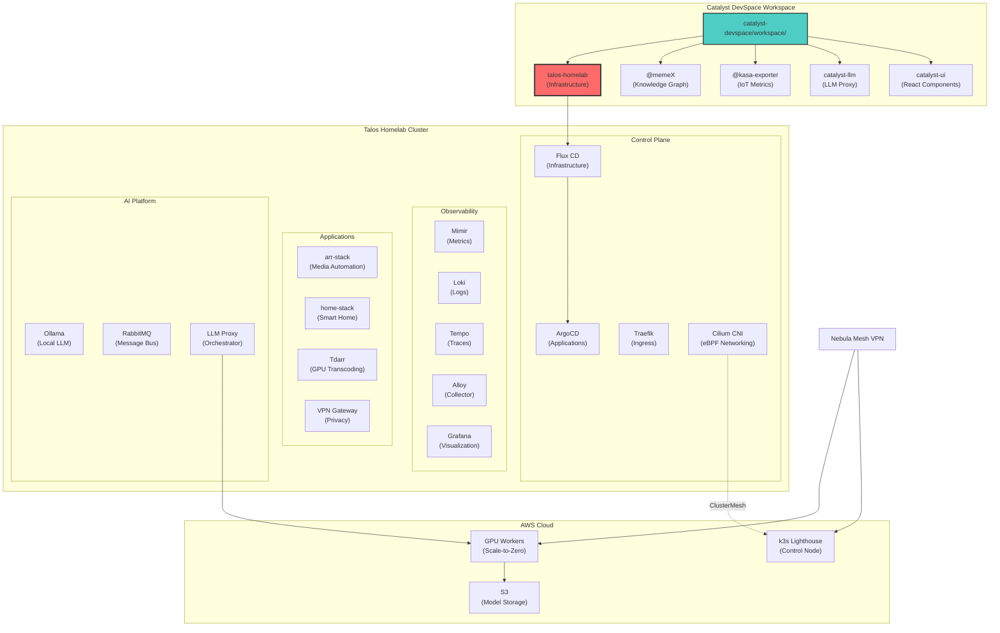
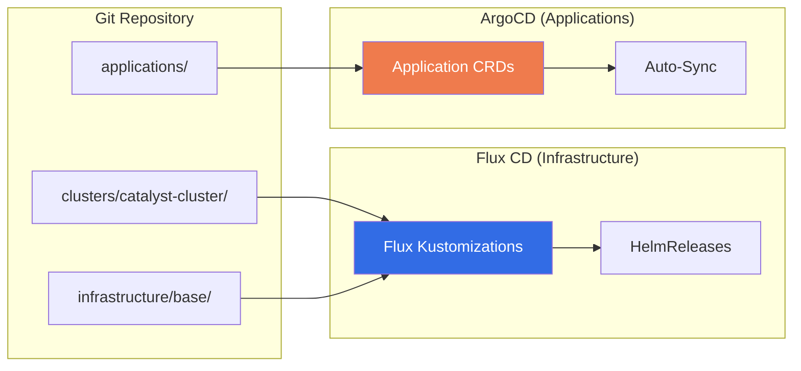
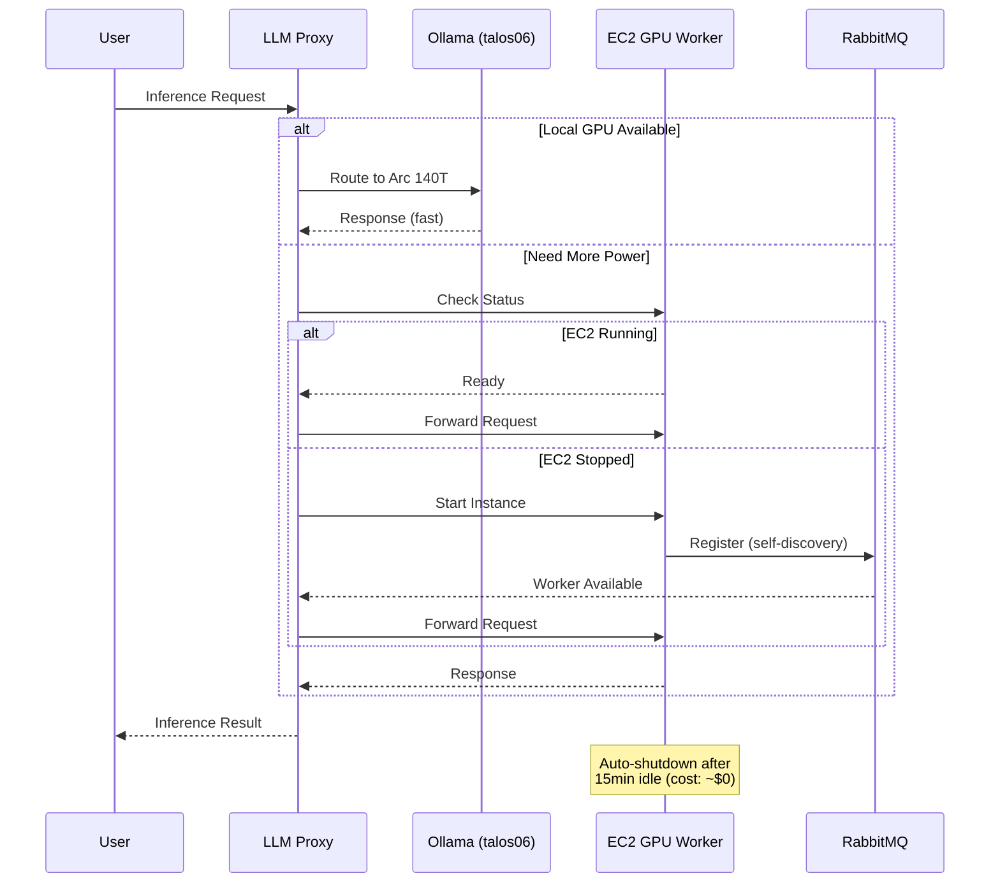
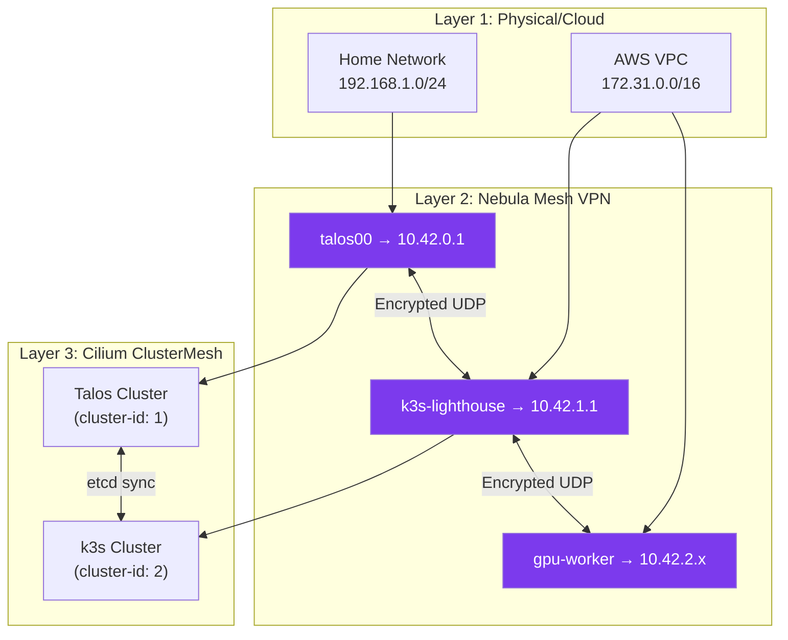
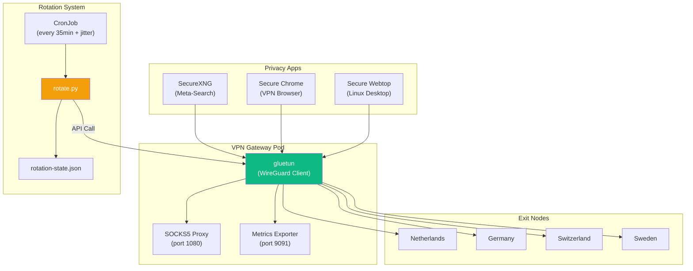
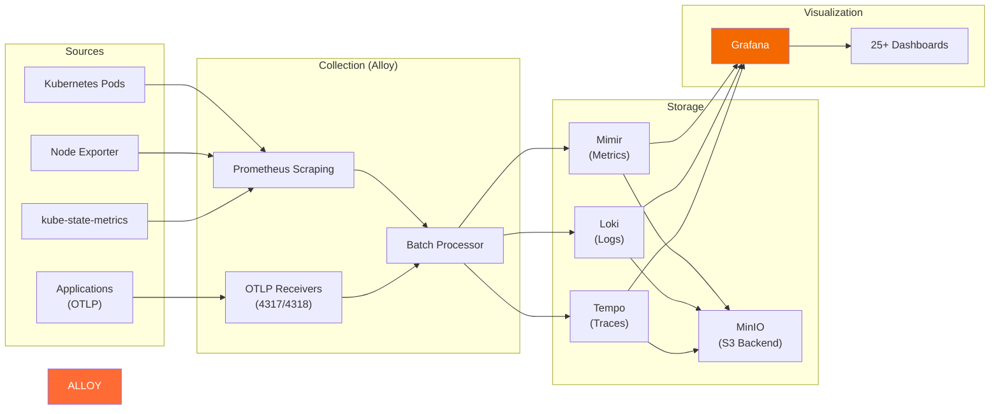
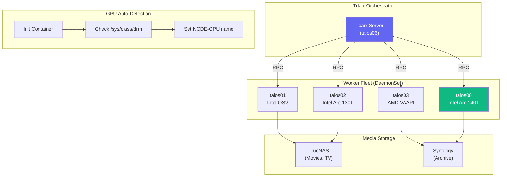
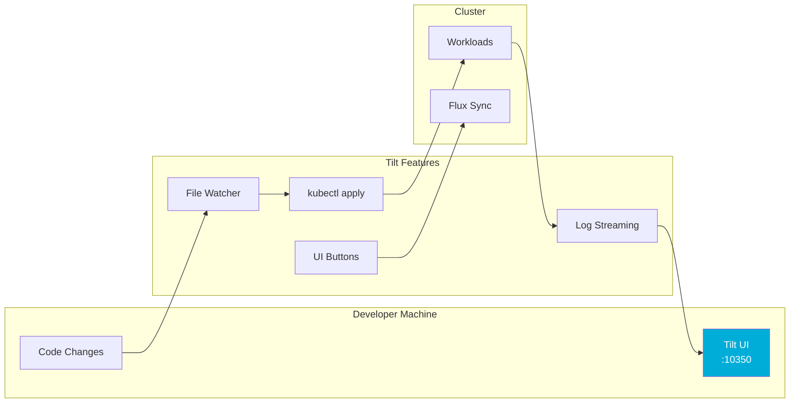
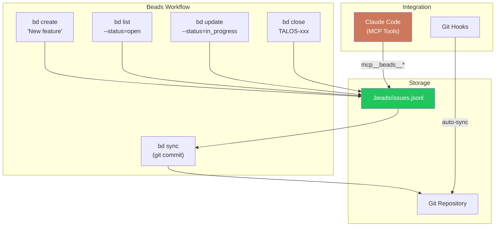

# Talos Homelab - Executive Summary

> **A production-grade Kubernetes homelab infrastructure demonstrating enterprise patterns at scale: GitOps, hybrid cloud AI, multi-cluster networking, and comprehensive observability.**

## TL;DR

This repository represents a **complete platform engineering implementation** featuring:

- **Dual GitOps** architecture (Flux for infrastructure, ArgoCD for applications)
- **Hybrid cloud AI** with scale-to-zero GPU workers (local Talos + AWS EC2)
- **Multi-cluster networking** via Cilium ClusterMesh + Nebula mesh VPN
- **Full observability stack** (Mimir, Loki, Tempo, Alloy - OTEL-native)
- **Privacy-focused VPN gateway** with automated key rotation
- **Media automation** with GPU-accelerated transcoding across heterogeneous hardware
- **Enterprise DevEx** with Tilt, Taskfiles, and comprehensive automation

---

## Architecture Overview



---

## Key Technical Achievements

### 1. Dual GitOps Architecture

A clear separation of concerns between infrastructure and application management:



| Layer | Tool | Manages | Philosophy |
|-------|------|---------|------------|
| Infrastructure | Flux CD | Namespaces, Storage, Monitoring, Ingress, CNI | Explicit execution, controlled changes |
| Applications | ArgoCD | User workloads, Media apps, Home automation | Auto-sync, continuous deployment |

### 2. Hybrid Cloud AI Platform

Scale-to-zero GPU infrastructure spanning local and cloud resources:



**Cost Optimization:**
- **On-demand**: ~$4.26/day (8 hours active)
- **Spot instances**: ~$1.30/day (80% savings)
- **Stopped state**: ~$0.001/hour (EBS only)
- **Model persistence**: No re-download on restart

### 3. Multi-Cluster Networking

Three-layer networking stack for secure cross-cluster communication:



**Key Features:**
- **NAT Traversal**: UDP hole-punching via Nebula lighthouse
- **mTLS**: Mutual authentication with SPIRE identity
- **Service Discovery**: Cross-cluster DNS resolution
- **Pod Mobility**: Transparent workload scheduling via Liqo

### 4. VPN Gateway with Rotation

Privacy-focused gateway with automated key rotation:



**Rotation Features:**
- Weighted random selection (least-used server preferred)
- Failed server cooldown (1-hour exclusion)
- Parallel or staggered rotation modes
- mTLS client authentication for external access
- Prometheus metrics for all rotation events

### 5. Observability Stack (OTEL-Native)

Modern telemetry pipeline built on OpenTelemetry standards:



**Capabilities:**
- **Metrics**: 1-year retention, 100k series/sec ingestion
- **Logs**: 30-day retention, structured with Kubernetes labels
- **Traces**: 7-day retention, service dependency mapping
- **Correlation**: Trace → Log → Metric linking in Grafana

### 6. GPU-Accelerated Media Processing

Heterogeneous GPU scheduling across cluster nodes:



**GPU Support:**
| Node | GPU | Codec Support | Use Case |
|------|-----|---------------|----------|
| talos01 | Intel QSV | H.264, HEVC | Standard transcoding |
| talos02 | Intel Arc 130T | H.264, HEVC, AV1 | Next-gen codecs |
| talos03 | AMD VAAPI | H.264, HEVC | Parallel processing |
| talos06 | Intel Arc 140T | H.264, HEVC, AV1 | Highest performance |

---

## Developer Experience

### Task Automation

Modular Taskfile structure with 90+ automated tasks:

```
Taskfile.yaml           # Root orchestrator
├── Taskfile.talos.yaml  # 33 Talos operations
├── Taskfile.k8s.yaml    # 18 Kubernetes tasks
├── Taskfile.dev.yaml    # 17 DevEx tools
└── Taskfile.infra.yaml  # 22 Infrastructure tasks
```

**Common Operations:**
```bash
task health          # Cluster health check
task lint            # Full code quality scan
task deploy-stack    # Infrastructure deployment
task dashboard       # Real-time cluster status
```

### Local Development with Tilt



### Git Hooks (Lefthook)

Pre-commit quality gates:
- **gitleaks**: Secret scanning
- **yamllint**: YAML validation
- **shellcheck**: Shell script linting
- **kustomize build**: Manifest validation
- **kubectl dry-run**: Kubernetes API validation

---

## Beads: AI-Native Issue Tracking

This repository uses **Beads** for issue tracking - a CLI-first tool designed for AI-assisted development workflows.



**Why Beads?**
- **Git-native**: Issues stored alongside code, synced with commits
- **AI-friendly**: CLI-first interface works seamlessly with Claude Code
- **MCP Integration**: Full CRUD via Model Context Protocol tools
- **Dependency Tracking**: `bd dep add` for issue relationships
- **No Context Switching**: No web UI required

**Current Roadmap (from Beads):**
| Issue | Type | Status | Description |
|-------|------|--------|-------------|
| TALOS-w5e0 | Epic | In Progress | Carrierarr base image system |
| TALOS-rrnk | Task | In Progress | Cilium ClusterMesh configuration |
| TALOS-700h | Feature | Open | Nebula mesh with home lighthouse |
| TALOS-wlu | Epic | Open | Security hardening (layered defense) |
| TALOS-n8an | Epic | Open | Arr-stack PostgreSQL migration |

---

## Technology Stack

### Infrastructure Layer
| Component | Technology | Purpose |
|-----------|-----------|---------|
| OS | Talos Linux | Immutable, minimal Kubernetes OS |
| CNI | Cilium | eBPF networking, ClusterMesh |
| GitOps | Flux CD + ArgoCD | Dual-pattern deployment |
| Ingress | Traefik | HTTP routing, mTLS |
| Secrets | External Secrets + 1Password | Secure secret management |
| Certificates | cert-manager | Let's Encrypt automation |

### Observability Layer
| Component | Technology | Purpose |
|-----------|-----------|---------|
| Metrics | Grafana Mimir | Long-term metrics storage |
| Logs | Grafana Loki | Log aggregation |
| Traces | Grafana Tempo | Distributed tracing |
| Collection | Grafana Alloy | Unified telemetry collector |
| Visualization | Grafana | Dashboards and alerting |

### Application Layer
| Component | Technology | Purpose |
|-----------|-----------|---------|
| Media | Sonarr, Radarr, Plex, Jellyfin | Media automation |
| Transcoding | Tdarr | GPU-accelerated encoding |
| Smart Home | Home Assistant | Home automation |
| AI/LLM | Ollama + LLM Proxy | Local and cloud inference |
| VPN | gluetun + ProtonVPN | Privacy gateway |

### Hybrid Cloud Layer
| Component | Technology | Purpose |
|-----------|-----------|---------|
| Mesh VPN | Nebula | P2P encrypted overlay |
| Federation | Liqo | Transparent cluster offloading |
| Fleet Mgmt | Carrierarr | gRPC + RabbitMQ agent control |
| GPU Compute | AWS EC2 (g4dn/g5) | Scale-to-zero GPU workers |
| Storage | AWS S3 | Model persistence |

---

## Repository Structure

```
talos-homelab/
├── infrastructure/base/          # Platform infrastructure
│   ├── argocd/                  # Application GitOps
│   ├── cilium/                  # CNI + ClusterMesh
│   ├── traefik/                 # Ingress controller
│   ├── monitoring/              # OTEL observability stack
│   ├── vpn-gateway/             # Privacy gateway + rotation
│   ├── external-secrets/        # 1Password integration
│   ├── hybrid-llm/              # AWS + Nebula + Liqo
│   └── databases/               # Operator-managed DBs
│
├── applications/                 # User workloads
│   ├── arr-stack/               # Media automation (15+ services)
│   ├── catalyst-llm/            # Hybrid AI platform
│   ├── home-stack/              # Smart home
│   └── scratch/                 # Experimental apps
│
├── clusters/catalyst-cluster/    # Flux cluster configuration
│   ├── flux-system/             # Flux bootstrap
│   └── *.yaml                   # Kustomization resources
│
├── tools/                        # Custom tooling
│   ├── ec2-agent/               # GPU worker orchestration
│   ├── carrierarr/              # Fleet management (gRPC)
│   └── beads-manager/           # Issue tracking UI
│
├── scripts/                      # Automation
│   ├── hybrid-llm/              # AWS provisioning
│   ├── lib/                     # Shared shell libraries
│   └── *.sh                     # Deployment scripts
│
├── configs/                      # Machine configurations (gitignored)
├── docs/                         # Documentation
└── .beads/                       # Issue tracking database
```

---

## Quick Start

```bash
# 1. Clone and setup
git clone https://github.com/TheBranchDriftCatalyst/talos-homelab.git
cd talos-homelab
task deps                    # Install tooling

# 2. Configure cluster access
export TALOS_NODE=192.168.1.54
task kubeconfig-merge        # Enable kubectl

# 3. Verify health
task health                  # Cluster health
task get-pods               # All workloads

# 4. Check current work
bd ready                     # Available issues
bd stats                     # Project health
```

---

## Key Differentiators

1. **Production Patterns at Homelab Scale**: Enterprise-grade architecture (GitOps, observability, multi-cluster) sized for personal infrastructure

2. **Hybrid Cloud Without Vendor Lock-in**: AWS GPU bursting via Nebula mesh - no proprietary peering required

3. **AI-First Development Workflow**: Beads issue tracking + Claude Code integration for seamless AI-assisted development

4. **Cost-Optimized GPU Compute**: Scale-to-zero with ~$1.30/day for on-demand GPU access

5. **Privacy by Design**: VPN gateway with rotation, mTLS, no logs by default

6. **Heterogeneous GPU Fleet**: Automatic detection and scheduling across Intel/AMD/NVIDIA hardware

---

## Contact

**Repository**: [github.com/TheBranchDriftCatalyst/talos-homelab](https://github.com/TheBranchDriftCatalyst/talos-homelab)

**Part of**: [catalyst-devspace](https://github.com/TheBranchDriftCatalyst) - Integrated development workspace

---

## Related Issues

<!-- Beads tracking for this doc -->
- TALOS-w5e0 - Carrierarr base image system (in_progress)
- TALOS-rrnk - Cilium ClusterMesh configuration (in_progress)
- TALOS-wlu - Security hardening epic (open)
