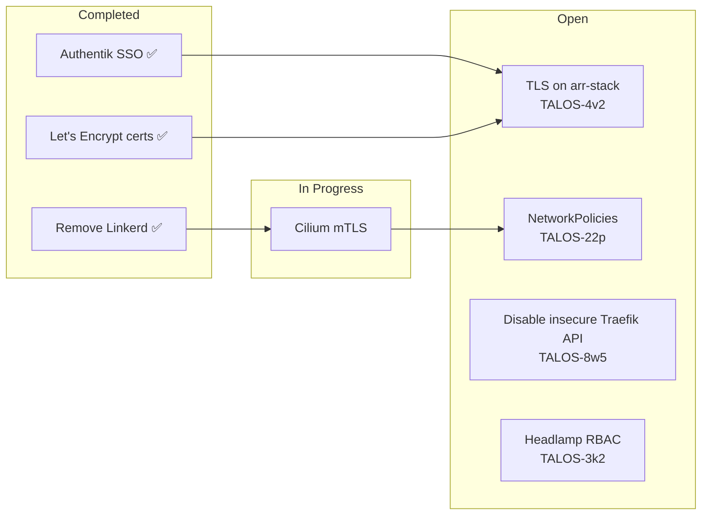
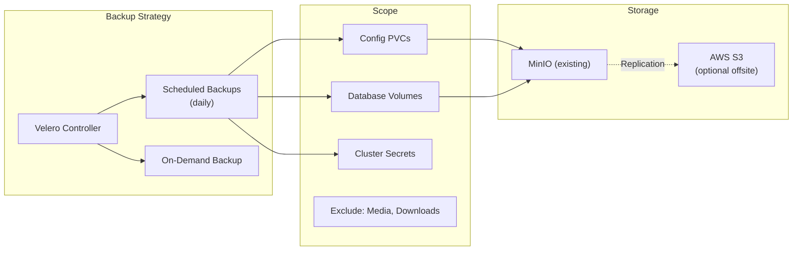
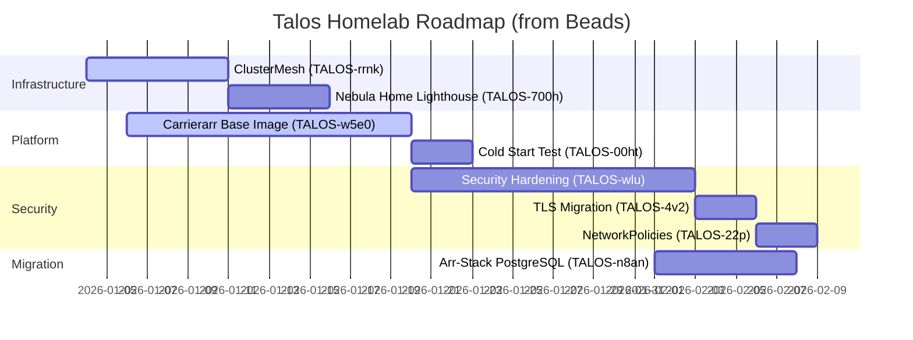

# Talos Homelab - Follow-up Recommendations

> **Gap analysis and roadmap recommendations based on current implementation review.**

## TL;DR

This document identifies gaps in the current infrastructure and provides actionable recommendations. Key areas:

- **Security**: Secrets rotation, TLS everywhere, NetworkPolicies
- **Reliability**: Backup strategy, disaster recovery, HA patterns
- **Observability**: Alerting, SLOs, dashboards for custom apps
- **Documentation**: Architecture diagrams, runbooks, onboarding

---

## Current State Assessment

### Strengths

| Area | Status | Evidence |
|------|--------|----------|
| GitOps Architecture | Excellent | Dual Flux/ArgoCD pattern with clear separation |
| Observability Stack | Excellent | Full OTEL (Mimir, Loki, Tempo, Alloy) |
| VPN Gateway | Excellent | Rotation, mTLS, multi-exit nodes |
| Hybrid Cloud | Good | EC2 + Nebula + Liqo working, needs polish |
| DevEx Tooling | Good | Taskfiles, Tilt, hooks, but scattered docs |
| GPU Scheduling | Good | Auto-detection, multi-vendor support |

### Gaps Identified

| Area | Gap | Priority | Beads Issue |
|------|-----|----------|-------------|
| Secrets | PostgreSQL password hardcoded, no rotation | Critical | TALOS-wlu (child) |
| TLS | arr-stack services exposed HTTP | High | TALOS-4v2 |
| Network Policies | No CiliumNetworkPolicies defined | High | TALOS-22p |
| Backup | No Velero configuration, annotations only | High | (create new) |
| Alerting | Mimir ruler configured but no alerts defined | Medium | (create new) |
| Documentation | Missing architecture diagrams, runbooks | Medium | (create new) |
| Testing | No integration/smoke tests for deployments | Medium | (create new) |
| Cost Tracking | No AWS cost visibility/budgets | Low | (create new) |

---

## Recommendations by Category

### 1. Security Hardening (TALOS-wlu Epic)

The security hardening epic already exists with child tasks. Current progress:



**Recommended Next Steps:**

1. **Secrets Rotation** (Missing from epic - CREATE NEW ISSUE):
   ```yaml
   # infrastructure/base/databases/secrets-rotation/
   # - ExternalSecrets with refreshInterval: 1h
   # - PostgreSQL password rotation via CloudNativePG
   # - AWS Secrets Manager integration for EC2 credentials
   ```

2. **Complete TLS Migration** (TALOS-4v2):
   - Add `tls: {}` to all arr-stack IngressRoutes
   - Configure TLSStore with wildcard cert
   - Update Homepage links to HTTPS

3. **Implement NetworkPolicies** (TALOS-22p):
   ```yaml
   # Suggested CiliumNetworkPolicy structure:
   # - Default deny ingress for media namespace
   # - Allow Traefik → services
   # - Allow arr-stack → PostgreSQL
   # - Allow egress to external APIs (TMDB, TVDB)
   ```

### 2. Backup & Disaster Recovery

**Current State**: Velero annotations present but no Velero deployment.

**Recommendation**: Deploy Velero with S3 backend:



**Files to Create**:
```
infrastructure/base/velero/
├── namespace.yaml
├── helmrelease.yaml
├── schedule-daily.yaml
├── schedule-weekly.yaml
└── kustomization.yaml
```

**Beads Issue to Create**:
```bash
bd create --title="Deploy Velero backup with MinIO backend" \
  --type=feature \
  --priority=1 \
  --description="Deploy Velero for cluster backup. Use existing MinIO as S3 backend. Configure daily backups for config/db PVCs, weekly for full cluster state."
```

### 3. Alerting & SLOs

**Current State**: Mimir ruler enabled, PrometheusRules synced via Alloy, but no alerts defined.

**Recommendation**: Implement tiered alerting:

```yaml
# infrastructure/base/monitoring/alerting/
# Tier 1: Critical (PagerDuty/Slack immediate)
- TargetDown (any scrape target unreachable > 5m)
- NodeNotReady (Kubernetes node unhealthy)
- PodCrashLooping (>5 restarts in 15m)
- CertificateExpiring (< 7 days)

# Tier 2: Warning (Slack channel)
- HighMemoryUsage (> 85% for 10m)
- HighCPUUsage (> 90% for 10m)
- PVCNearlyFull (> 80%)
- TranscodeQueueBacklog (> 100 items)

# Tier 3: Info (Dashboard only)
- NewDeployment
- ScaleEvent
- VPNRotation
```

**Integration Options**:
1. **Discord Webhook** (already configured for ArgoCD)
2. **Alertmanager → Discord** route
3. **Grafana Alerting** (for dashboard-based alerts)

### 4. Documentation Improvements

**Current State**: CLAUDE.md is comprehensive but some areas undocumented.

**Recommendation**: Add structured documentation:

```
docs/
├── 01-getting-started/
│   └── README.md              # Exists, good
├── 02-architecture/
│   ├── README.md              # Needs update
│   ├── dual-gitops.md         # Exists, good
│   ├── hybrid-cloud.md        # CREATE: EC2+Nebula+Liqo
│   └── observability.md       # CREATE: OTEL stack details
├── 03-operations/
│   ├── runbooks/
│   │   ├── node-failure.md    # CREATE
│   │   ├── gpu-troubleshoot.md # CREATE
│   │   └── vpn-rotation.md    # CREATE
│   └── backup-restore.md      # CREATE (with Velero)
├── 04-development/
│   ├── tilt-workflow.md       # CREATE
│   ├── beads-workflow.md      # CREATE
│   └── adding-new-app.md      # CREATE
└── executive-summary.md       # CREATED
```

### 5. Testing & Validation

**Current State**: Pre-commit hooks validate manifests but no runtime tests.

**Recommendation**: Add smoke tests:

```bash
# scripts/smoke-tests/
├── test-ingress.sh      # curl all IngressRoutes
├── test-flux.sh         # flux get all, check ready
├── test-argocd.sh       # argocd app list, check synced
├── test-observability.sh # query Mimir/Loki/Tempo
└── test-vpn.sh          # check VPN gateway status
```

**GitHub Actions Workflow**:
```yaml
# .github/workflows/smoke-tests.yaml
on:
  schedule:
    - cron: '0 */4 * * *'  # Every 4 hours
  workflow_dispatch:

jobs:
  smoke-tests:
    runs-on: self-hosted  # Cluster access
    steps:
      - uses: actions/checkout@v4
      - run: ./scripts/smoke-tests/run-all.sh
```

---

## Beads Integration Explained

### How Beads Works

Beads is an AI-native issue tracking system that stores issues directly in the git repository:

```
.beads/
├── issues.jsonl         # All issues (append-only JSONL)
├── config.toml          # Project configuration
└── README.md            # Documentation
```

**Key Concepts**:

1. **Git-Native Storage**: Issues are stored in `.beads/issues.jsonl` and synced with git commits. No external database required.

2. **MCP Integration**: Claude Code has direct access via Model Context Protocol tools:
   - `mcp__beads__list` - Query issues
   - `mcp__beads__create` - Create new issues
   - `mcp__beads__update` - Update status/priority
   - `mcp__beads__close` - Close completed work
   - `mcp__beads__show` - View issue details
   - `mcp__beads__dep` - Manage dependencies

3. **Dependency Tracking**: Issues can block other issues:
   ```bash
   bd dep add TALOS-abc TALOS-xyz  # abc depends on xyz
   bd blocked                       # Show all blocked issues
   bd ready                         # Show unblocked, ready to work
   ```

4. **Session Protocol**: End-of-session workflow ensures work is captured:
   ```bash
   git add <files>           # Stage code changes
   bd sync                   # Commit beads changes
   git commit -m "..."       # Commit code
   git push                  # Push to remote
   ```

### Current Roadmap (from Beads)



### Creating New Issues for Recommendations

Based on this analysis, create the following issues:

```bash
# Backup & DR
bd create --title="Deploy Velero backup with MinIO backend" \
  --type=feature --priority=1 \
  --labels="infrastructure,backup" \
  --description="Deploy Velero for cluster backup. Use existing MinIO as S3 backend. Configure daily backups for config/db PVCs, weekly for full cluster state."

# Alerting
bd create --title="Implement Mimir alerting rules with Discord notification" \
  --type=feature --priority=2 \
  --labels="monitoring,alerting" \
  --description="Create PrometheusRules for critical/warning/info alerts. Configure Alertmanager to send notifications to Discord webhook."

# Documentation
bd create --title="Create operational runbooks for common scenarios" \
  --type=task --priority=3 \
  --labels="documentation" \
  --description="Write runbooks for: node failure, GPU troubleshooting, VPN rotation issues, backup/restore procedures."

# Testing
bd create --title="Add smoke test suite for infrastructure validation" \
  --type=feature --priority=3 \
  --labels="testing,devex" \
  --description="Create shell scripts to validate all ingresses, Flux resources, ArgoCD apps, and observability endpoints. Add GitHub Actions workflow for scheduled execution."

# Add dependencies
bd dep add <velero-issue> TALOS-wlu    # Backup depends on security
bd dep add <alerting-issue> TALOS-wlu  # Alerting depends on security
```

---

## Priority Matrix

| Recommendation | Effort | Impact | Priority |
|----------------|--------|--------|----------|
| Secrets rotation | Medium | Critical | P0 |
| TLS on arr-stack | Low | High | P1 |
| NetworkPolicies | Medium | High | P1 |
| Velero backup | Medium | High | P1 |
| Alerting rules | Medium | Medium | P2 |
| Runbook documentation | Low | Medium | P2 |
| Smoke tests | Low | Medium | P3 |
| Cost tracking | Low | Low | P4 |

---

## Quick Wins (< 2 hours each)

1. **Add TLS to arr-stack IngressRoutes**: Just add `tls: {}` to each file
2. **Create Discord alert channel**: Configure webhook, update Alertmanager
3. **Add basic smoke test**: Single script checking all Flux kustomizations
4. **Document hybrid-cloud architecture**: Mermaid diagram + setup steps

---

## Related Issues

<!-- Beads tracking for this doc -->
- TALOS-wlu - Security Hardening Epic (open)
- TALOS-4v2 - TLS on arr-stack (open)
- TALOS-22p - NetworkPolicies (open)
- TALOS-8w5 - Disable Traefik insecure API (open)
- TALOS-3k2 - Fix Headlamp RBAC (open)
