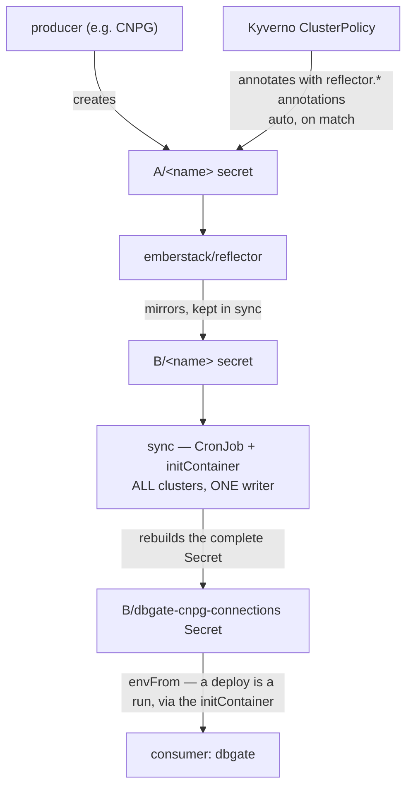

# Cross-namespace secret reflection (Kyverno + reflector)

## TL;DR

A secret is produced in namespace **A** but needed in namespace **B**. Kubernetes secrets are
namespace-scoped and `secretKeyRef` can't cross namespaces. This pattern **mirrors** the secret
into B — **automatically, for every current and future producer, with zero per-secret config**:



The **wiring into the consumer is a single-writer reconcile** — a small job discovers every CNPG
cluster + its mirrored `-app` secret and rebuilds the _complete_ dbgate connection Secret, which
dbgate loads via `envFrom`. **Zero per-cluster config** anywhere. (An earlier attempt used a second
Kyverno `mutateExisting` policy to inject the env per-cluster; it does **not** work — see [§4](#4-consume--dbgate-connections-single-writer).)

**Worked example in this repo:** auto-connect **dbgate** (ns `databases`) to every **CloudNativePG**
Postgres cluster, whose `<cluster>-app` credentials live in each cluster's own namespace.

## The problem

- Consumer lives in one namespace (`databases` — dbgate).
- Producers scatter credentials across many namespaces (`crowdsec`, `forgejo`, …; each CNPG
  cluster gets a `<cluster>-app` Secret in _its_ namespace).
- `secretKeyRef` is namespace-local, so the consumer can't read them.
- Doing it by hand (copying secrets, or a per-cluster annotation) doesn't scale and drifts.

## The pieces

### 1. Producer — CloudNativePG

Each `Cluster` generates a `<cluster>-app` basic-auth Secret (username/password/dbname/uri/…) in
its namespace, labelled `cnpg.io/cluster: <cluster>`. That label is our selector hook.

### 2. Auto-annotate — Kyverno mutating `ClusterPolicy`

[`infrastructure/base/kyverno-policies/reflect-cnpg-app-secrets.yaml`](../../infrastructure/base/kyverno-policies/reflect-cnpg-app-secrets.yaml)
stamps the reflector annotations onto every matching secret:

```yaml
apiVersion: kyverno.io/v1
kind: ClusterPolicy
metadata: { name: reflect-cnpg-app-secrets }
spec:
  rules:
    - name: annotate-app-secret-for-reflection
      match:
        any:
          - resources:
              kinds: [Secret]
              names: ['*-app'] # only the app-creds secret
              selector:
                matchExpressions:
                  - { key: cnpg.io/cluster, operator: Exists } # only CNPG's
      mutate:
        mutateExistingOnPolicyUpdate: true # ← retrofits ALREADY-existing secrets
        targets:
          - apiVersion: v1
            kind: Secret
            name: '{{ request.object.metadata.name }}'
            namespace: '{{ request.object.metadata.namespace }}'
        patchStrategicMerge:
          metadata:
            annotations:
              reflector.v1.k8s.emberstack.com/reflection-allowed: 'true'
              reflector.v1.k8s.emberstack.com/reflection-allowed-namespaces: 'databases'
              reflector.v1.k8s.emberstack.com/reflection-auto-enabled: 'true'
              reflector.v1.k8s.emberstack.com/reflection-auto-namespaces: 'databases'
```

One rule covers both timelines:

- **Existing** secrets → mutated when the policy is installed/updated (`mutateExistingOnPolicyUpdate`).
- **New/updated** secrets → the secret's admission triggers the rule; the background controller
  applies the same patch shortly after.

### 3. Mirror — emberstack/reflector

[`infrastructure/base/reflector`](../../infrastructure/base/reflector) runs the controller. Given the
`reflection-*` annotations on a source secret, it creates/keeps a copy in the target namespace(s)
with the **same name**. Change the source → the mirror updates.

### 4. Consume — dbgate connections (single writer)

dbgate reads env-based connections in the format `<PARAM>_<id>` (**not** `CONNECTION_<id>_<param>`):
`CONNECTIONS` is a csv enumerator (required for multi-connection), and
`ENGINE_/SERVER_/PORT_/USER_/PASSWORD_/DATABASE_/LABEL_<id>` carry each connection. Env-var names
must be `[A-Za-z0-9_]`, so `id` = cluster name with `-postgres`/`-db` stripped and `-` → `_`.

A single **reconcile job** ([`dbgate-connection-sync`](../../infrastructure/base/databases/dbgate-connection-sync/))
`kubectl get clusters.postgresql.cnpg.io -A`, reads each cluster's mirrored `<cluster>-app` secret
in `databases`, and writes the **complete** set into the `dbgate-cnpg-connections` Secret
(`stringData`, credentials inline). dbgate loads it via `envFrom`. The dbgate manifest ships **only
base env** (`WEB_ROOT`, `LOGINS`) + that `envFrom`. Two things run the same script (shared ConfigMap):

- an **initContainer** on dbgate → **"a deploy = a run"**: regenerates the Secret _before_ the main
  container starts, so a fresh pod is never empty and there's no poll lag;
- a **CronJob** (every 15 min) → catches clusters added between deploys (rolls dbgate on change).

**Why a single writer and NOT a Kyverno `mutateExisting` policy** (this was tried first and abandoned
under TALOS-5ccm — the failure is the whole point of the pattern):

1. **Concurrent writes to one shared target lose data.** A mutate rule triggered per source
   `-app` secret has _N_ triggers all patching the _same_ dbgate Deployment. They collide on
   optimistic concurrency (`Operation cannot be fulfilled on deployments "dbgate": the object has
been modified`), and Kyverno's background controller **does not retry** — so a _random subset_ of
   the per-cluster env lands. Symptom: `CONNECTIONS` lists a cluster but its `ENGINE_<id>` is
   missing → dbgate errors `missing ENGINE` / `could not get driver`. Non-deterministic and
   unfixable by tuning. Aggregating _N sources into 1 consumer_ wants a **single writer** that builds
   the complete set atomically — exactly a CronJob/initContainer.
2. **The injected env doesn't survive a Deployment recreation** (image bump, reschedule): the fresh
   pod comes up with zero connections until a trigger happens to re-fire. `envFrom` a persistent
   Secret has no such gap.
3. **Stopping the policy leaves its fields behind.** Kyverno's injected env is owned by the
   `background-controller` SSA field manager; Flux only manages _its_ fields, so removing the policy
   (and `spec.ignore`) does **not** prune them, and a stale `CONNECTIONS` in `container.env`
   _overrides_ `envFrom`. Cleanup requires delete+recreate of the Deployment.

(Because the writer is a job, no Flux `spec.ignore` is needed — the dbgate Deployment env is fully
git-managed; the connections live in the separate CronJob-owned Secret.)

**A fourth reason, and the one that decides the shape: mutating a Flux-managed object costs you
drift detection.** Anything Kyverno writes into a Flux-managed Deployment is reverted on the next
reconcile unless the owning [`databases` Kustomization](../../clusters/catalyst-cluster/databases.yaml)
carries a `spec.ignore` entry for that JSON-pointer path — otherwise the env round-trips
(Kyverno injects → Flux reverts → Kyverno re-injects). But an ignored path is a path Flux no longer
manages: you buy the mutation by giving up drift detection on the consumer's entire `env` block, and
`Kustomization.spec.ignore` needs Flux ≥ 2.9 (kustomize-controller v1.9) to exist at all.

Writing to a **separate Secret** instead of into the consumer's spec avoids the trade entirely.
`databases.yaml` declares no `ignore`; the dbgate Deployment stays fully git-managed and drift-checked,
and the only thing outside git is the CronJob-owned Secret it `envFrom`s. If you find yourself
reaching for `spec.ignore`, that is the signal to move the generated data out of the spec.

## Why Kyverno (vs. per-cluster annotations)

You _can_ annotate each producer explicitly — for CNPG, `spec.inheritedMetadata.annotations`
propagates onto the generated secret. But that's per-cluster boilerplate that's easy to forget on
the next cluster. The Kyverno policy makes it **declarative and automatic**: match once, and every
present + future CNPG cluster is covered with no extra config.

## Gotchas (learned the hard way)

- **`mutateExisting` needs extra RBAC.** Kyverno's _background_ controller cannot read/update
  Secrets by default (security). Grant it with an aggregated ClusterRole (label
  `rbac.kyverno.io/aggregate-to-background-controller: "true"`) — shipped alongside the policy.
  Without it the policy reports `not authorized to update Secret`.
- **Selector precision.** CNPG also makes `-ca`, `-replication`, `-server` cert secrets. Match
  `names: ["*-app"]` **plus** the `cnpg.io/cluster` label so only the credentials secret is touched.
- **User-provided secrets are invisible to the policy.** If you pre-create the `<cluster>-app`
  secret yourself (e.g. to pin a known password via `bootstrap.initdb.secret`), CNPG _adopts_ it but
  does **not** add the `cnpg.io/cluster` label → _both_ policies' selectors miss it. Fix: add the
  `cnpg.io/cluster: <cluster>` label to that secret's manifest so it flows through **both** policies
  uniformly (mirror + dbgate-connection injection). Also add any keys the connection policy expects
  (a user-provided basic-auth secret has only `username`/`password`; add a `dbname` key so the
  `DATABASE_<id>` `secretKeyRef` resolves). `homeassistant-postgres-app` was the example here
  until it stopped pinning its password; it now lets CNPG generate the secret
  ([`postgres-appdb.yaml`](../../applications/home-automation/base/homeassistant/postgres-appdb.yaml)),
  which gets the `cnpg.io/cluster` label automatically, so no manifest in this repo hits this case.
- **Aggregate N→1 with a single writer, never per-source mutation.** See §4: concurrent Kyverno
  mutations of one shared consumer lose writes (no retry) and don't survive a recreate. The
  CronJob/initContainer rebuilds the _complete_ set atomically into one `envFrom` Secret.
- **Give the consumer a "deploy = a run".** An initContainer running the same sync script means a
  fresh pod is never empty and never lags the CronJob — the main container `envFrom`s the
  freshly-written Secret. Set `DO_RESTART=false` in the initContainer (it's already starting).
- **`envFrom`, not `container.env`, for the generated set.** A stale key in `container.env`
  _overrides_ `envFrom`; keep the consumer's own `env` to base only so the CronJob-owned Secret is
  authoritative. (And if you migrate _off_ a Kyverno mutation, delete+recreate the target — Flux
  won't prune fields owned by Kyverno's `background-controller` field manager.)
- **CRD ordering.** Keep the Kyverno install and the ClusterPolicies in **separate Flux
  Kustomizations** (`kyverno-policies` `dependsOn: kyverno`, `wait: true`) so the `kyverno.io` CRDs
  exist before any policy is applied.

## Reusing this pattern elsewhere

Any "produced here, consumed there" secret is a candidate — see `TALOS-shnu`:

- shared TLS / wildcard certs consumed by ingresses in multiple namespaces,
- a registry pull-secret needed in many namespaces,
- an ESO-materialised secret used by more than one app.

Either extend the existing policy's `match` or add a sibling ClusterPolicy with the right selector,
and point the `reflection-allowed-namespaces` / `reflection-auto-namespaces` at the target(s).

## File map

| File                                                                  | Role                                                                                                             |
| --------------------------------------------------------------------- | ---------------------------------------------------------------------------------------------------------------- |
| `infrastructure/base/kyverno/`                                        | Kyverno install (the admission controller is deliberately not single-replica — a webhook outage is cluster-wide) |
| `infrastructure/base/kyverno-policies/reflect-cnpg-app-secrets.yaml`  | mirror policy: annotate `-app` secrets for reflector + background RBAC                                           |
| `infrastructure/base/databases/dbgate-connection-sync/`               | **single writer**: CronJob + shared-script ConfigMap + RBAC → builds the `dbgate-cnpg-connections` Secret        |
| `infrastructure/base/reflector/`                                      | emberstack/reflector install                                                                                     |
| `infrastructure/base/databases/dbgate/deployment.yaml`                | consumer (dbgate) — base env only + `envFrom` the generated Secret + initContainer ("a deploy = a run")          |
| `clusters/catalyst-cluster/databases.yaml`                            | `databases` Flux Kustomization (env fully git-managed; no `spec.ignore` needed)                                  |
| `clusters/catalyst-cluster/{kyverno,kyverno-policies,reflector}.yaml` | Flux Kustomizations                                                                                              |

---

## Related Issues

- `TALOS-5ccm` — the abandoned Kyverno `mutateExisting` design whose failure modes §4 records
- `TALOS-shnu` — back-propagating this pattern to the remaining cross-namespace secrets
