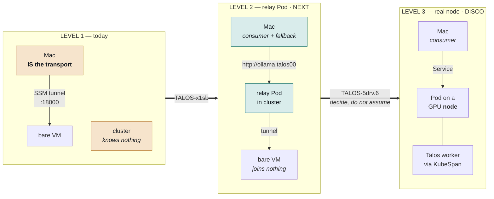

# XGPUInstance — roadmap

Where the GPU inference plane is going, and the one question that decides it.
[`architecture.md`](architecture.md) describes what exists today; this file describes
what changes and why. Epic **TALOS-5drv**.

---

## The decision this whole roadmap turns on

"GPU is a Kubernetes node, inference server is a Pod" is load-bearing across the entire
ecosystem — HPA, DRA, device plugins, readiness probes, EndpointSlices, metrics scraping,
Gateway API Inference Extension, KServe, Karpenter all assume it. Our GPU box is
deliberately **not** a cluster member, so we opt out of all of it and hand-rebuild each
piece.

Every wall hit so far is that same wall:

| What failed | Why |
| --- | --- |
| `gpu-broker` writing an EndpointSlice | validation **rejects loopback** addresses, and the tunnel lands on `127.0.0.1` |
| `addressType: FQDN` as an escape hatch | unimplemented by any core component; kube-proxy programs no rules |
| Adopting Modelplane's routing | `InferencePool` is Pod-only and forbids `ExternalName` |
| Adopting KubeAI as a front | engine enum is closed and CEL-enforced |

Those are not four problems. They are one problem four times.

**The metric to watch: how many Pod-shaped things are we rebuilding?** Currently four —
service discovery, readiness, scale-to-zero, routing. If that list grows, the topology is
the cost and Level 3 is the answer. If `/scale` on the XR (**TALOS-5mfc**) collapses
scale-to-zero and routing into one mechanism we already own, the list shrinks and bespoke
was right.

---

## Three levels



| | ecosystem | box runs | cost |
| --- | --- | --- | --- |
| **L1** today | none | DL Base GPU AMI | — |
| **L2** relay Pod | probes, selectors, Services, EndpointSlices, HPA, `/scale` | DL Base GPU AMI | one Pod |
| **L3** real node | all of it | **Talos + NVIDIA extensions** | fleet reconfigure + new AMI |

---

## Level 2 — the relay Pod (TALOS-x1sb, next)

**The goal, stated plainly: take the Mac out of the loop.** Today the tunnel terminates
on the laptop, so `catalyst-operator` is not a *consumer* of the inference endpoint — it
**is** the transport. Close the lid and inference dies, and nothing else on the network
can reach the box at all.

A relay Pod in the cluster holds the tunnel instead. The GPU box joins nothing and keeps
its working AMI. From the cluster's point of view there is now a Pod serving inference, so
the Pod-shaped machinery works normally.

### Target end state — one stable URL, forever

```text
catalyst-operator → http://ollama.talos00
    warm: interceptor → gpu-backend Service → relay Pod → tunnel → vLLM on EC2
    cold: coldStart.fallback → ollama-mac (192.168.1.33:11434)
```

The operator stops deriving ports and stops caring which rig is on — it points at a
hostname. The Mac becomes a **consumer** and a **fallback backend**, never the path.

That also *shrinks* the endpoint contract we just built in
[`apps/gpu-profiles.yaml`](apps/gpu-profiles.yaml): no local ports, no per-rig derivation.

The fallback target already exists and already works — `mac-sdlc-node/ollama-mac` is a
live Service with an EndpointSlice carrying `192.168.1.33:11434`. A LAN IP is **not**
loopback, which is precisely why that one is legal where `gpu-backend`'s `127.0.0.1` can
never be.

### Concrete diff

- `gpu-service.yaml` — give `gpu-backend` a label **selector** matching the relay Pod and
  **delete** the hand-written EndpointSlice. It cannot ever work.
- New relay Deployment holding the tunnel, carrying the instance-id re-resolve logic that
  currently lives in `scripts/gpu-tunnel.sh`. A Pod is a better home for that than a shell
  loop: restart policy, liveness probe and backoff instead of `sleep 15` and hoping.
- `ingressroute.yaml` already serves `ollama.talos00` with the `lan-only` middleware from
  TALOS-a8vo.4. Point it **straight at `gpu-backend` and skip KEDA entirely** at first —
  Level 2's win does not depend on scale-to-zero.
- `catalyst-operator` — `LITELLM_BASE_URL` becomes `http://ollama.talos00`.

### Open decision: the transport

Pick before building. All three preserve "the box joins nothing".

| | keeps egress-only SG | new artifact | note |
| --- | --- | --- | --- |
| **(a) SSM in a Pod** | yes | image with `session-manager-plugin` + creds | changes no security posture; SSM already proven on this box |
| **(b) IP-allowlisted inbound** | **no** | none | least code — a public IP is routable, so an EndpointSlice could hold it with no Pod at all |
| **(c) Reverse tunnel** (chisel/frp/`ssh -R`) | yes | stock image, userData client | elegant; needs the homelab reachable from AWS, and a boot-time dependency on that service being up |

**(a) is the conservative default.** (b) contradicts the composition's own header — *"SG
is egress-only — the box TUNNELS OUT, no public inference port"* — and this repo has
already taken a WAN-exposure hit (TALOS-a8vo.4: host-spoof from off-net reached an
unauthenticated admin surface, which is why `lan-only` exists).

### What Level 2 unblocks

`TALOS-x1sb` **blocks** all three of these, and none is worth starting first:

- **TALOS-5mfc** — `/scale` on the XR. Crossplane XRDs can serve it from v2.3.0 and this
  cluster runs **v2.3.4** (verified: the XRD CRD carries 6 `specReplicasPath`
  occurrences). `replicas: 0 → 1` could provision the rig with no KEDA interceptor at all.
  k8s here is 1.36.4, one minor before `HPAScaleToZero` is default-on.
- **TALOS-rzjx** — `HTTPScaledObject` → `InterceptorRoute`. Both APIs are served here
  today so nothing is broken, but v1alpha1 was deleted upstream on 2026-09-30. The new API
  is a genuine upgrade: `timeouts.readiness` separate from `timeouts.request`, and
  `coldStart.fallback` giving the Mac-Ollama failover natively.
- **TALOS-5drv.5** — the KEDA demand plane. Deferred deliberately until a cold boot is
  boring.

---

## The trigger — git commit, today (TALOS-5drv.7)

Separate from Level 2/3, and resolvable independently. **Today a rig exists because a
human uncommented a line and pushed.** Three problems with that, and one is a
contradiction already in the repo.

### It is slow and human-only

`git commit → push → source reconcile → operators → aws-providers → aws → aws-apps`.
Each layer waits a full reconcile interval, so provisioning takes **minutes before AWS is
even called**. Nothing can trigger it but a person with push access — the operator can
consume a GPU, never ask for one.

### Two contradictory ownership models, both deliberate, both written down

[`../gpu-inference/README.md`](../gpu-inference/README.md):

> | **XGPUInstance / XGPUCache existence** | **gpu-broker** |
>
> The two XRs are **not committed**. TALOS-455u documents three zombie modes that make any
> other arrangement lose ... Flux never asserting XR *existence* removes all three.

[`apps/kustomization.yaml`](apps/kustomization.yaml) says the opposite — the file's line
**is** the on-switch, so git *does* assert XR existence. Both cannot hold.

### The contradiction already has a live symptom

`gpu-testrig-reaper` deletes the XR at 6h and Flux puts it straight back, so the reaper is
a **churn, not a teardown** — it caps a box's age and turns nothing off. That is zombie
mode #2 from TALOS-455u, happening today. With `/cache` on instance store, a churn now
also re-streams the weights.

It is also why scale-to-zero cannot work yet: **you cannot scale something git keeps
reasserting.**

### Options

| | model | trade |
| --- | --- | --- |
| **(a)** broker-owned existence | demand creates the XR; git holds only XRD/Composition/profile | sides with the README. Cost: git stops being the record of what is billing — hence that README's *"`kubectl get xgpuinstance` is the only source of truth for what is currently billing"* |
| **(b)** `/scale` — **preferred** | git asserts the XR at `replicas: 0`; **demand owns the count** | dissolves the contradiction instead of picking a side: existence stays declarative and auditable, *running* does not |
| **(c)** KEDA HTTP interceptor | *orthogonal* — decides what counts as demand, not who owns existence | under (b), a request, `kubectl scale`, an operator API call or a schedule all work, because each just moves a number |

(b) is what the repo already reaches for by analogy: *"Same principle as keeping `replicas`
out of git when an HPA owns them: the spec stays declarative, the count does not."*
Mechanism is **TALOS-5mfc**; **TALOS-5drv.7** is the *policy* decision about who owns
what, and should be settled first so the mechanism is built against a decided policy
rather than the reverse.

Blocked on **TALOS-x1sb** — until the cluster has a Pod-shaped handle on the box there is
nothing for a scaler to target and no readiness signal to gate on.

Deliverable is an ADR **plus correcting whichever README is now wrong**. Leaving both in
place is how the next person loses a day.

---

## Level 3 — GPU as a real node (TALOS-5drv.6, discovery only)

**It needs neither Nebula nor a lighthouse.** Talos KubeSpan is WireGuard built into
Talos, with peer discovery through the Talos discovery service rather than a node we run.
[`apps/talos-worker-poc.yaml`](apps/talos-worker-poc.yaml) already sketches it and carries
the line that answers the question:

```yaml
openPort: 0 # KubeSpan dials out; no inbound needed with discovery service
```

So it replaces the whole dormant stack — no lighthouse, no DDNS, no Nebula certs, no socat
forwarders, no Cilium ClusterMesh. Worth knowing that `clusters/aws-k3s/` *tried* the mesh
route and is **DORMANT** (verified 2026-08-22): clustermesh apiserver at 0 replicas, no
`nebula` namespace, forwarders never wired into Flux, `aws-lighthouse` context not
answering. A tried and abandoned path, not an untried alternative.

### Two prerequisites, both verified 2026-10-01, both non-trivial

1. **KubeSpan is not enabled.** No `kubespan` anywhere in `configs/talconfig.yaml`, and no
   node carries a `networking.talos.dev/assigned-prefix` annotation. Enabling it is a
   machineconfig change across all 5 nodes — a rolling reconfigure of the production
   cluster for a feature only the cloud box needs.
2. **NVIDIA-on-Talos is not solved.** Despite the name, `talos02-gpu` is an **Intel** node
   — allocatable is `{gpu.intel.com/i915: 10}`, no `nvidia.com/gpu` at all. Fleet-wide
   extensions are `amd-ucode, amdgpu, i915, intel-ucode, iscsi-tools, mei`. Level 3 means
   an Image Factory schematic with `nonfree-kmod-nvidia` + `nvidia-container-toolkit`
   pinned to Talos v1.13.9 / kernel 6.18.44, published as an AMI, plus the device plugin —
   and it **gives up** the DL Base GPU AMI's pre-baked drivers, which work today.

### How to de-risk it cheaply

Do **not** start by building the GPU AMI. Boot one cheap **non-GPU** Talos worker over
KubeSpan first: that proves the mesh half without touching GPU drivers, and it is the half
that historically collapsed. Only then decide about NVIDIA extensions.

And start by answering the question at the top of this file — whether the four rebuilt
Pod-shaped things shrink or grow once `TALOS-5mfc` lands.

---

## Status

| | item | state |
| --- | --- | --- |
| `TALOS-rkg0` | Local-NVMe cache, unpinned placement | **done** |
| `TALOS-5drv.2` | Derive `tensorParallelSize` at boot | **done** |
| `TALOS-5drv.3` | Stream weights from S3 (Run:ai Model Streamer) | **done** |
| `TALOS-5drv.4` | One-rig admission guard (Kyverno, armed + verified) | **done** |
| `TALOS-i91u` | EC2 Fleet instance-type diversification | **done** |
| `TALOS-tt48` | `gpuprofile.yaml` drift | **done** |
| **`TALOS-x1sb`** | **Level 2 — relay Pod (keystone)** | **next** |
| `TALOS-5drv.7` | **Trigger model** — git vs demand owns XR existence | blocked on x1sb |
| `TALOS-5drv.6` | DISCO: Level 3 via KubeSpan | open |
| `TALOS-5drv.1` | Modelplane adopt/borrow ADR | open |
| `TALOS-5mfc` | `/scale` on the XR (mechanism for 5drv.7) | blocked on 5drv.7 |
| `TALOS-rzjx` | `HTTPScaledObject` → `InterceptorRoute` | blocked on x1sb |
| `TALOS-5drv.5` | Wire the KEDA demand plane | blocked on x1sb, deferred |
| `TALOS-tt0c` | Build + push `runpod-mac-bundle` (unblocks image gen) | open |
| `TALOS-46y0` | Migrate staged 235B weights to the derived S3 key | open |
| `TALOS-vuf5` | Runbook: region/VPC moves need manual MR deletion | open |
| `TALOS-fwl9` | `ClusterPolicy` → `ValidatingPolicy` | open |

### Not on the roadmap, deliberately

- **Adopting Modelplane.** Current recommendation is stay bespoke on provisioning, borrow
  the API shape — its routing layer is Pod-only, so it cannot reach non-node boxes without
  the same relay Pod, and it vendors Gateway API Inference Extension at v1.0.2 against
  upstream v1.6.0. Reasoning belongs in `TALOS-5drv.1`'s ADR.
- **Raising the G/VT vCPU quota beyond 48.** One rig at a time is the invariant, and 48 is
  exactly one 4-GPU box. Quota should be headroom, never a brake — that mistake is already
  recorded in [`apps/kustomization.yaml`](apps/kustomization.yaml).
- **Attribute-based instance selection.** Available on this provider, deliberately unused:
  the hand-verified `shapes` table is safer than something that could silently reach a
  `p5.48xlarge` at ~$98/hr.
