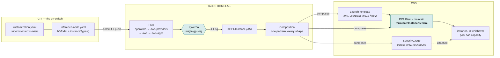
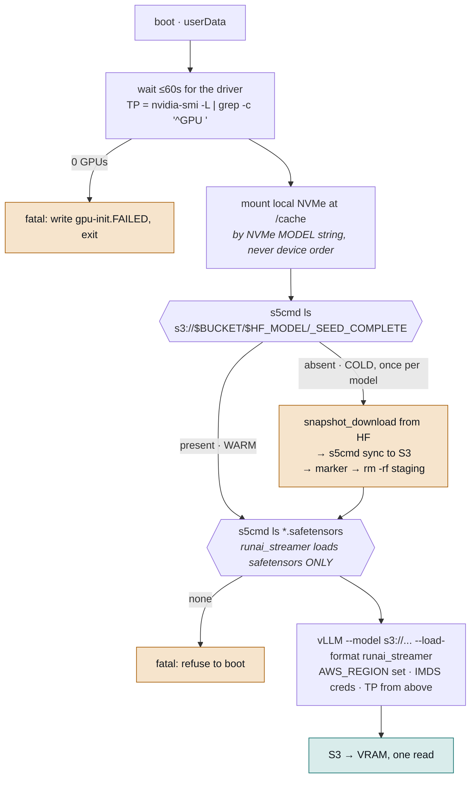
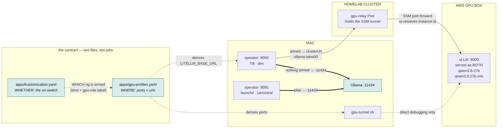
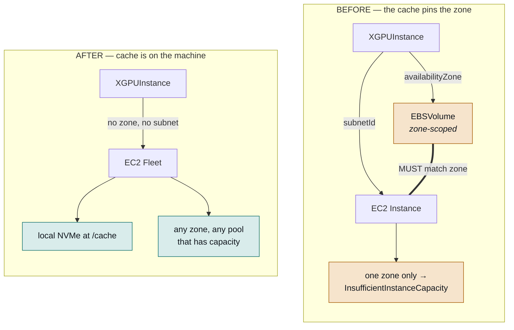

# XGPUInstance — ephemeral GPU inference plane

A local operator doing its LLM inference on an AWS GPU box that a git commit conjures
and a git revert destroys. One Crossplane pattern, a HuggingFace id as the only model
input, and weights that stream from S3 straight into VRAM.

Colocated with what it describes: [`xgpuinstance-xrd.yaml`](xgpuinstance-xrd.yaml),
[`xgpuinstance-composition.yaml`](xgpuinstance-composition.yaml), the claims in
[`apps/`](apps/), and the sizing + endpoint table in
[`apps/gpu-profiles.yaml`](apps/gpu-profiles.yaml).

> **Everything is OFF, and off is the default.** Both claims are commented out of
> [`apps/kustomization.yaml`](apps/kustomization.yaml). There is no scale-to-zero
> (deferred on purpose — see [Where this is going](#where-this-is-going)), so that line
> *is* the cost control. The one-rig admission guard is armed and verified.

---

## Three planes

The system decomposes into three independent flows, and nearly every failure has lived
cleanly inside one of them. Worth keeping apart when debugging: the **control plane**
decides what exists, the **weights plane** gets bytes to the GPU, and the **request
plane** carries tokens back to the Mac.

### Control plane



A claim's presence in `apps/kustomization.yaml` is the only switch. Flux walks a
four-deep chain (`operators → aws-providers → aws → aws-apps`) before the claim lands;
each layer waits a full reconcile interval, so a change takes minutes and
`DependencyNotReady` mid-cascade is normal, not a fault.

The composition owns **four** resources — security group, its egress rule, a launch
template, and a fleet. No EBS volume and no bare instance; see
[the edge that had to disappear](#the-edge-that-had-to-disappear) and
[one type is one pool](#one-instance-type-is-one-capacity-pool).

Two lines in that fleet carry disproportionate weight:

- **`terminateInstances: true`.** The provider documents it as *"Defaults to false."* At
  the default, deleting the XR leaves a billing GPU box running with nothing tracking it.
- **`type: maintain`**, forced by AWS docs rather than preference. `request` explicitly
  *"does not submit requests in alternative Spot capacity pools if capacity is
  unavailable"*, which defeats the point of a pool; `instant` is one synchronous shot
  with no retry.

### Weights plane — streamed, with seed-on-miss

`hfModel` is the single model input and the S3 prefix is *derived* from it, so adding a
model is one line. vLLM reads that prefix **directly** via its bundled Run:ai Model
Streamer — the warm path is one S3 read into VRAM.



The amber seed path runs **once per model**, ever, and converts itself into the warm
path. `_SEED_COMPLETE` is the branch key, so it is written only after the sync succeeds —
a marker without bytes would send every later boot down the warm path against an
incomplete prefix.

**Why there is no "load from local disk" path any more.** `/cache` is `mkfs -f`'d on
every boot, so the local disk is *never* already warm. The old warm path paid the same S3
read **plus** a ~31GB write **plus** a ~31GB read. There is no state in which it wins, so
the "local NVMe is ~7GB/s vs ~1GB/s network" caution — true in general — is unreachable
here. `/cache` now only holds HF staging during a cold seed, and `HF_HOME`.

Three details that are load-bearing rather than hygiene:

- **`httpPutResponseHopLimit: 2`** on the launch template. The default of 1 reaches a
  process on the host but not inside a container — and vLLM now authenticates to S3 from
  *inside* the container on every boot. At hop limit 1 the weights simply never load.
- **`AWS_REGION` is mandatory.** The streamer infers no region from the URI.
- **`AWS_EC2_METADATA_DISABLED` is deliberately NOT set.** vLLM's own docs set it in the
  *S3-compatible* (MinIO) recipe where it only skips a startup delay. Copying that onto
  real S3 disables IMDS and kills instance-profile auth dead.

`/cache` is identified by its NVMe model string
(`lsblk -dno NAME,MODEL | awk '/Instance Storage/'`), not by device order. Verified live
on `i-07c9140f294b30ed9`, both disks are `nvme*`:

```text
nvme0n1  Amazon Elastic Block Store        100G   ← root
nvme1n1  Amazon EC2 NVMe Instance Storage  419G   ← /cache
```

A device-order guess would have formatted the root volume.

`tensorParallelSize` is **derived**, not declared — it must equal the machine's GPU
count, and a pool spanning 1-GPU and 4-GPU shapes has no single correct value. It uses
`grep -c '^GPU '` rather than `wc -l` because nvidia-smi prints diagnostics on failure,
which `wc -l` would count as a plausible GPU. Zero GPUs is fatal: a visibly dead box with
the reaper as backstop beats a quietly mis-served one.

### Request plane

Every rig's security group is **egress-only, with no inbound rules at all**. AWS Session
Manager is the only way in; there is no public inference port.



**One home for the endpoint contract.** The tunnel's local port was previously hardcoded
in four code locations across two repos; the served model name was worse — a
producer/consumer pair (`spec.servedModelName` on the claim,
`~/.catalyst/llm-config.yaml` on the Mac) with nothing checking they agree, where
disagreement is a 404 at chat time. Both now live in
[`apps/gpu-profiles.yaml`](apps/gpu-profiles.yaml) under `endpoint:`, read by
`scripts/gpu-tunnel.sh` and by the operator's Tiltfile and Taskfile.

That also makes **down-by-default fall out** rather than being a second decision: with no
rig armed, the operator resolves to `endpoint.localFallbackUrl` — the Mac's Ollama — so
Tilt-side chat works with nothing provisioned and no tunnel running. Flip a rig on and the
same code picks up the endpoint. Tilt prints which one it chose and why.

**"Armed" means an uncommented claim line in
[`apps/kustomization.yaml`](apps/kustomization.yaml), and nothing else.** The table used to
carry a `rigs[].state` field saying the same thing, and on 2026-10-02 the two drifted: a rig
was armed and billing while the table read `off`, which would have pointed the operator at
local Ollama while paying for a GPU (TALOS-cmni). The kustomization is what Flux acts on, so
it cannot disagree with reality; a second copy of the fact can.

The rule is implemented once, in
[`scripts/lib/armed-rigs.rb`](../../../scripts/lib/armed-rigs.rb), and a rig is identified
there by its claim's **kind and `catalyst.io/gpu-role` label — never by its filename**. A
`gpu-node-` filename prefix used to do that job, and nothing errors when a prefix stops
matching: every consumer just reports "off" while a GPU bills, which made renaming a rig
unsafe. The role label is needed because an LLM box and an image box are both
`kind: XGPUInstance`.

The remaining asymmetry worth knowing: the **endpoint** comes from `LITELLM_BASE_URL`
(read only by `catalyst_langgraph/config.py`, whose `BASE_URL_ENV_ORDER` is exactly that
one name) while the **model name** comes from `llm-config.yaml`, where yaml is layered
last and beats env — so `MAIN_CHAT_DEFAULT_MODEL` cannot override it. Serving the Mac's
Ollama tag as a *second* `--served-model-name` alias is what lets one shared model string
resolve against either backend, so pointing `:9092` at a remote box does not break
`:9091`. vLLM's `--served-model-name` takes `nargs='+'`, which is why `servedModelName`
is space-separated and interpolated **unquoted**.

`gpu-tunnel.sh` re-resolves the instance id every attempt, because that id is not stable —
spot interruption and the reaper both hand you a new one. Local ports are **18000/18012,
not 8000/8012**: on the Mac `:8000` is fchat-bouncer's uvicorn and `:8012` is
mac-sdlc-node's comfyui-shim.

---

## The edge that had to disappear

An EBS volume is zone-scoped — it only attaches to an instance in its own zone — so a
cache on EBS forced the claim to name one zone. That pin is exactly what AWS tells you to
remove when it refuses capacity.



Deleting the volume deleted the doubled `MUST match zone` edge, the two placement fields,
a monthly gp3 charge, and a hand-deletion dance: upjet **refuses** immutable-field
replacement (`cannot change the value of the argument "availability_zone"`), so every
zone change previously meant deleting the `EBSVolume` managed resource by hand.

## One instance type is one capacity pool

Unpinning the zone was necessary but not sufficient. With placement free, AWS chose across
every zone in us-west-2 and still returned `Insufficient capacity` **with no zone named**,
then the same in us-east-2, before us-east-2c eventually opened. Both on spot *and* on
on-demand.

Hence `instanceTypes` — a pool of 1-6 acceptable shapes rendered into per-override slots
on the fleet, so AWS picks whichever has capacity. Every entry must fit the model, and the
most expensive entry sets the worst-case bill.

Explicit overrides rather than attribute-based selection, even though ABIS is available on
this provider: the repo already has a hand-verified shapes table, and ABIS could silently
reach a `p5.48xlarge` (~$98/hr) or a different quota family.

**Accepted regression:** editing userData no longer rolls the box. A launch template edit
only creates a new version, a `maintain` fleet does not roll onto it, and EC2 Fleet has no
instance refresh — that is an ASG feature and `provider-aws-autoscaling` is not installed
(no `autoscalinggroups` MRD exists at all). The reaper churn converges it in practice; an
urgent fix needs a deliberate git-off/on.

---

## Constraints learned the hard way

### Provider resources ship inactive

Crossplane v2 registers managed resources behind `ManagedResourceDefinition` +
`ManagedResourceActivationPolicy`. 339 MRDs exist here; the policy activated 21. So
`kubectl api-resources` showed only 5 ec2 kinds, which *looks* like "this provider cannot
do fleets" and is not — the capability was switched off:

```text
$ kubectl get mrd | grep -iE 'fleet|launchtemplate'
fleets.ec2.aws.upbound.io           Active   True   # after activation
launchtemplates.ec2.aws.upbound.io  Active   True   # after activation
```

Both are now listed in
[`../aws-providers/activation-policy.yaml`](../aws-providers/activation-policy.yaml).
**Without both, the composition renders kinds the API server does not serve and every
claim sits `Synced=False` forever.** The restraint is deliberate: a 2026-08-15 incident
here was CRD-load driven at ~250 CRADs and forced removing the ec2 provider. Current
count is 383 against a crossplane memory limit of 4Gi at ~566Mi in use.

### Quota is per-region, not per-AZ

`L-3819A6DF` ("All G and VT Spot Instance Requests") is one vCPU ceiling per **region**.
There is no per-AZ GPU quota. A 4-GPU `.12xlarge` is 48 vCPU, so a region at 48 hosts
exactly one and nothing else; a region at 32 cannot host one at all, whatever the capacity.

| region | spot | on-demand | usable |
| --- | --- | --- | --- |
| us-west-2 | 32 | 48 | 1-GPU shapes only |
| us-east-2 | 48 | 48 | up to 4-GPU (exactly 48) |
| us-east-1 | 0 | 0 | nothing |
| eu-central-1 | 0 | 0 | nothing |

Increases to 64 are open as AWS Support cases. They **cannot be amended or cancelled** via
API — service-quotas exposes delete/put for *templates* only — and the Support API needs a
Premium Support subscription this account lacks. Note `g6.12xlarge` scores **9/9 spot
placement in eu-central-1** and is entirely unreachable there at quota 0.

### Spot is often not cheaper

Spot price is **capped at on-demand**. Measured for `g6e.2xlarge` in us-west-2:

| AZ | spot | vs on-demand ($2.242) |
| --- | --- | --- |
| us-west-2a | $1.424 | 36% off — **no capacity** |
| us-west-2d | $1.940 | 13% off — **no capacity** |
| us-west-2b / 2c | $2.242 | **0.0% off** |

The only zones with a real discount were the ones with no capacity. Hence `capacityType`,
and why the 1-GPU rig runs on-demand while the 4-GPU rig stays spot (on-demand
`g6e.12xlarge` is ~$10.49/hr against ~$5.17 spot).

`capacityType` has **no default by necessity**: there is no "on-demand" marketType — it is
the *absence* of market options — and a patch can only be skipped when its source field is
absent. Omitting the field therefore costs **more**, which both claims state explicitly.

### Reported VRAM is below the marketing number

From `describe-instance-types`. Budget KV cache against these, not datasheets.

| shape | GPU | reported VRAM | instance store | vCPU | on-demand |
| --- | --- | --- | --- | --- | --- |
| g5.2xlarge | 1× A10G | 22.4 GiB | 450 GB | 8 | $1.212 |
| g6e.2xlarge | 1× L40S | **44.7 GiB** | 450 GB | 8 | $2.242 |
| g6e.4xlarge | 1× L40S | 44.7 GiB | 600 GB | 16 | $3.004 |
| g6.12xlarge | 4× L4 | 89.4 GiB | 3760 GB | 48 | $4.602 |
| g5.12xlarge | 4× A10G | 89.4 GiB | 3800 GB | 48 | $5.672 |
| g6e.12xlarge | 4× L40S | 178.8 GiB | 3800 GB | 48 | $10.493 |

An L40S reports 45776 MiB = 44.7 GiB, **not "48 GB"**; an A10G 22.4 GiB, not 24.

### Model sizes

| model | size | fits |
| --- | --- | --- |
| `Qwen/Qwen3.8-27B-FP8` | 30.9 GB | 1× L40S and up (Ada FP8) |
| `Qwen/Qwen3.8-27B` (bf16) | 55.6 GB | 4-GPU only |
| `Qwen/Qwen3-32B-AWQ` | 19.3 GB | 1× L40S; loads on A10G at ~8k ctx |
| `Qwen/Qwen3.5-122B-A10B-GPTQ-Int4` | 78.9 GB | 4-GPU, tight on 89.4 GiB |
| `Qwen/Qwen3-235B-A22B-GPTQ-Int4` | 124.6 GB | 4× L40S only |

`Qwen3.8-27B` is `Qwen3_5ForConditionalGeneration` — a native VLM with hybrid attention
(`16 × (3 × Gated DeltaNet → 1 × Gated Attention)`). Confirmed present in
`vllm/vllm-openai:v0.30.0`'s model registry, which is why that tag is **pinned**: a
floating tag on a multi-dollar-per-hour box is a reproducibility hazard, and this
architecture needs a known-good version. The AMI must also stay a concrete id — upjet
rejects `resolve:ssm:` aliases, *and* AWS documents that `maintain`/`request` fleets do not
support a launch template carrying an SSM parameter in place of an AMI.

### Moving a rig between regions needs manual cleanup

upjet refuses immutable-field replacement, so changing `region`/`vpcId` strands the
security group and its rule. Delete the dependent first. Runbook in **TALOS-vuf5**.

---

## Cost and safety controls

There are three, and only three:

1. **The claim's line in `apps/kustomization.yaml`.** git-off is the real teardown. The
   primary control, and why off is the default.
2. **The one-rig admission guard** —
   [`../kyverno-policies/single-gpu-rig.yaml`](../kyverno-policies/single-gpu-rig.yaml).
   Denies a second `XGPUInstance` while one exists, naming the rig in the way. Armed and
   verified live: first rig allowed, second denied, a claim labelled
   `catalyst.io/allow-concurrent: "true"` exempt. A deliberate two-rig test must label
   **both** claims.
   A `ValidatingAdmissionPolicy` **cannot** do this — its CEL environment has no lister and
   `authorizer` answers "may this user do X", not "how many exist". Kyverno's
   `context.apiCall` does a real list. The policy has **no `default:`** on that call and
   `failurePolicy: Fail`, so an RBAC or API error **denies** rather than counting zero:
   failing closed costs a retry, failing open costs $7.41/hr. One known gap — admission-time
   counting has a TOCTOU window that no admission mechanism closes.
3. **`terminateInstances: true`** on the fleet, which is what makes deleting the XR
   actually stop the bill.

Plus `apps/gpu-testrig-reaper.yaml` (`*/15`, 6h, matching `catalyst.io/stage: poc-demo`) —
but note what it does: while a claim is ON in git, deleting the XR just makes Flux
recreate it, so 6h is a **churn**, not a teardown. It caps a box's age; it turns nothing
off. With `/cache` on instance store a churn now also means re-streaming the weights.

Relying on the vCPU quota as a brake is explicitly **not** a control. That repeats a
mistake already recorded in `apps/kustomization.yaml`: *"the missing credential was acting
as an undeclared brake ... restoring it immediately began creating real AWS resources that
nobody had actually decided to run."*

---

## Where this is going

Epic **TALOS-5drv**.

| | item | status |
| --- | --- | --- |
| `TALOS-rkg0` | Local-NVMe cache, unpinned placement | **done** |
| `TALOS-5drv.4` | One-rig admission guard | **done, armed, verified** |
| `TALOS-5drv.2` | Derive `tensorParallelSize` at boot | **done** |
| `TALOS-5drv.3` | Stream weights from S3 (Run:ai Model Streamer) | **done** |
| `TALOS-i91u` | EC2 Fleet instance-type diversification | **done** |
| `TALOS-tt48` | `gpuprofile.yaml` drift | **done** |
| `TALOS-5drv.1` | Read Modelplane → adopt / borrow / bespoke ADR | open |
| `TALOS-5mfc` | XRDs can serve `/scale` on v2.3.4 | open |
| `TALOS-rzjx` | `HTTPScaledObject` → `InterceptorRoute` | open |
| `TALOS-x1sb` | Demand plane has no reachability hop | open |
| `TALOS-tt0c` | Build + push `runpod-mac-bundle` to GHCR | open |
| `TALOS-46y0` | Migrate staged 235B weights to the derived S3 key | open |
| `TALOS-vuf5` | Runbook: region/VPC moves need manual MR deletion | open |
| `TALOS-fwl9` | `ClusterPolicy` → `ValidatingPolicy` migration | open |
| `TALOS-5drv.5` | Wire the KEDA demand plane | **deferred** |

Three findings shaping the remainder:

- **Scale-to-zero may not need KEDA at all.** Crossplane XRDs can serve `/scale` from
  v2.3.0 and this cluster runs **v2.3.4** (verified: the XRD CRD carries 6
  `specReplicasPath` occurrences). `replicas: 0 → 1` on the XR could provision the rig
  directly. k8s here is 1.36.4, one minor before `HPAScaleToZero` is default-on.
  ([Crossplane PR #7004](https://github.com/crossplane/crossplane/pull/7004))
- **The current demand-plane design cannot work.** EndpointSlice validation rejects
  loopback addresses, so `gpu-broker` physically cannot write an SSM tunnel's `127.0.0.1`;
  `addressType: FQDN` is unimplemented by any core component; and no tunnel Pod exists.
  The fix has upstream precedent in llm-d's "dual pods" — run the tunnel in a Pod and
  select it by label. This is an independent reason `.5` was right to defer.
- **Modelplane is the mature form of this idea** — `InferenceCluster` / `InferenceClass` /
  `ModelDeployment` / `ModelReplica` with two-layer fleet scheduling reusing the
  Kubernetes DRA vocabulary. But its routing layer is Pod-only (`InferencePool` forbids
  `ExternalName`), so it cannot reach non-node boxes without the same relay Pod. Current
  recommendation: stay bespoke on provisioning, borrow the API shape.
  ([Crossplane blog](https://blog.crossplane.io/building-modelplane/))

---

## Commands

```bash
# What can actually launch right now — quota, placement score, live per-AZ price,
# AZ offerings, model/shape fit. Run this BEFORE flipping a claim on.
scripts/check-spot-avail.sh

# Turn a rig on/off: uncomment or comment its line, commit, push.
#   infrastructure/base/aws/apps/kustomization.yaml
flux reconcile source git flux-system
for k in operators aws-providers aws aws-apps; do flux reconcile kustomization "$k"; done

# Watch it come up. A maintain fleet does not report its instances, so status carries
# fleetId/fleetState/fulfilledCapacity — "did AWS actually find me a machine?"
kubectl get xgpuinstance -o wide
kubectl get xgpuinstance <rig> -o jsonpath='{.status.fleetState} {.status.fulfilledCapacity}{"\n"}'
aws ec2 describe-instances --region <r> --filters Name=tag:Name,Values=<rig> \
  --query 'Reservations[].Instances[].[InstanceId,InstanceType,State.Name,Placement.AvailabilityZone]' --output text

# Boot log without an interactive session
aws ssm send-command --region <r> --instance-ids <id> --document-name AWS-RunShellScript \
  --parameters 'commands=["tail -40 /var/log/gpu-init.log","cat /var/log/gpu-init.FAILED 2>/dev/null"]'

# From the catalyst-operator repo — all three derive the endpoint from gpu-profiles.yaml
task llm:tunnel     # targets whichever LLM rig is armed (ROLE=image for the other)
task llm:check      # probes the endpoint the operator is ACTUALLY using
task llm:spot       # the report above

# Confirm nothing is billing
for r in us-east-2 us-west-2; do
  aws ec2 describe-instances --region $r --filters Name=instance-state-name,Values=running,pending \
    --query 'Reservations[].Instances[?starts_with(InstanceType,`g`)].[InstanceId,InstanceType]' --output text
  aws ec2 describe-fleets --region $r --query 'Fleets[?FleetState==`active`].[FleetId,FulfilledCapacity]' --output text
  aws ec2 describe-volumes --region $r --filters Name=status,Values=available \
    --query 'Volumes[].[VolumeId,Size]' --output text
done
```

Prereq for the tunnel: `session-manager-plugin`. The Homebrew cask needs sudo; a no-sudo
install is `pkgutil --expand` on the AWS pkg and copying `usr/local/sessionmanagerplugin`
into `~/.local/`.
