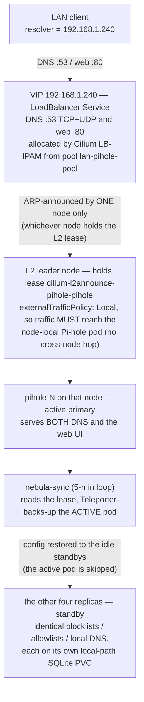

# Pi-hole HA Pattern

## TL;DR

LAN DNS + ad-blocking is highly available via **5 active Pi-holes (one per node)** behind a **single Cilium LB-IPAM VIP `192.168.1.240`**, ARP-announced by exactly **one node at a time** (L2 lease leader election), with **nebula-sync** keeping every replica's config identical.

- **Replicas**: `pihole` StatefulSet, 5 pods (`pihole-0..4`), one per node, each with its own local-path SQLite PVC (never NFS).
- **VIP**: one LoadBalancer Service (DNS `:53` TCP+UDP **and** web `:80`) on `192.168.1.240`, `externalTrafficPolicy: Local`.
- **IP assignment**: `CiliumLoadBalancerIPPool lan-pihole-pool` (block `.240–.250`, `serviceSelector app: pihole`).
- **L2 announce**: `CiliumL2AnnouncementPolicy lan-pihole-l2` → lease `cilium-l2announce-pihole-pihole` (kube-system). One holder ARP-owns the VIP; ETP=Local pins traffic to _that node's local pod_.
- **The pool is scoped to Pi-hole.** `lb-ipam.yaml` also holds separate pools for Traefik and the honeypot; a LoadBalancer matching no pool's `serviceSelector` sits `<pending>` forever rather than failing loudly.
- **Config sync**: `nebula-sync` Deployment (5-min loop) Teleporter-backs-up the active pod and restores to the idle standbys.
- **Failover**: lease-based, **no node preference and no failback** — VIP sticks to the last winner and "rotates" across nodes after reboots. Harmless because all Pi-holes are equal + synced.

---

## Quick Reference

### Live state (ground truth)

```bash
# Who currently owns the VIP (ARP announcer / active DNS+web primary)?
kubectl get lease -n kube-system cilium-l2announce-pihole-pihole \
  -o jsonpath='{.spec.holderIdentity}{"\n"}'          # → whichever node won the last election

# The VIP Service + its external IP
kubectl get svc -n pihole pihole                       # EXTERNAL-IP 192.168.1.240

# All 5 replicas and which node each lives on
kubectl get pods -n pihole -l app=pihole -o wide

# LB-IPAM pool health (IPs total/available, conflicts)
kubectl get ciliumloadbalancerippool lan-pihole-pool

# nebula-sync worker + its recent log (primary=, synced=, failed=)
kubectl logs -n pihole deploy/nebula-sync -c sync --tail=20
```

### Where things live

| Component                              | Path                                                                      |
| -------------------------------------- | ------------------------------------------------------------------------- |
| StatefulSet (5 replicas)               | `infrastructure/base/pihole/statefulset.yaml`                             |
| VIP Service (`.240`)                   | `infrastructure/base/pihole/service-vip.yaml`                             |
| Headless Service (pod DNS)             | `infrastructure/base/pihole/service-headless.yaml`                        |
| nebula-sync Deployment                 | `infrastructure/base/pihole/nebula-sync/deployment.yaml`                  |
| nebula-sync sync loop                  | `infrastructure/base/pihole/nebula-sync/sync.sh`                          |
| Cilium LB-IPAM pool + L2 policy        | `infrastructure/base/cilium/lb-ipam.yaml`                                 |
| Pi-hole dashboard (nebula_sync panels) | `infrastructure/base/monitoring/grafana-dashboards/json/pihole.json`      |
| Network-ops dashboard (LB-IPAM panels) | `infrastructure/base/monitoring/grafana-dashboards/json/network-ops.json` |

### nebula-sync metrics (`:9092/metrics` → Mimir via Alloy)

| Metric                                              | Meaning                                                      |
| --------------------------------------------------- | ------------------------------------------------------------ |
| `nebula_sync_runs_total{result="success\|failure"}` | Cumulative sync cycles by outcome                            |
| `nebula_sync_last_success_timestamp_seconds`        | Unix time of last fully-clean cycle (drives "Last sync age") |
| `nebula_sync_last_run_timestamp_seconds`            | Unix time of last attempt, any result                        |
| `nebula_sync_duration_seconds`                      | Wall-clock of the last cycle                                 |
| `nebula_sync_replicas_synced`                       | Standbys restored OK last cycle                              |
| `nebula_sync_replicas_failed`                       | Standbys that failed restore (0 = healthy)                   |

---

## Deep Dive

### Traffic path



_Which replica is active, and which node it sits on, are **decided at runtime, not by this diagram**: soft anti-affinity spreads one replica per node, but the scheduler decides where each replica lands and the L2 lease decides which one is active. Read both from the cluster (see the `kubectl` snippets above); never from this diagram._

### 1. Replicas + config sync (nebula-sync)

**Why a StatefulSet, not the mojo2600 chart:** each FTL keeps its own SQLite (`pihole-FTL.db` + `gravity.db`). SQLite must **not** be shared/NFS or it corrupts, so every pod gets a **per-pod local-path RWO PVC** (`etc-pihole-pihole-<n>`, 2Gi). StatefulSet also gives **stable identities** (`pihole-0..4`) so replicas are addressable. Key settings:

- `replicas: 5` (= node count), `podManagementPolicy: Parallel` (a DNS fleet, not an ordered database).
- **Soft** one-per-node anti-affinity (`preferredDuringScheduling…`, `topologyKey: kubernetes.io/hostname`) — spreads without deadlocking rollouts. Every node needs a local backend for the ETP=Local VIP.
- Tolerates the control-plane taint so a Pi-hole also runs on `talos00`.
- `priorityClassName: pihole-critical` — schedule first, evict last.
- A Pi-hole **v6** image plus a `pihole-exporter` sidecar on `:9617`. The sidecar exists because v6 has no native `/metrics` — it speaks the v6 REST API and re-exposes Prometheus metrics. Read both image pins from `statefulset.yaml`; the comments in `podmonitor.yaml` still name an older exporter and are not authoritative.

**nebula-sync** (`app: nebula-sync`, _not_ `app: pihole`, so it is never a VIP endpoint or a self-sync target) is a single Deployment (`strategy: Recreate`) running `sync.sh` on a **5-minute loop** (`SYNC_INTERVAL=300`). Note: this is Pi-hole **config sync via the v6 Teleporter API** — it is _not_ "Nebula" the mesh VPN (name collision only). Each cycle:

1. Read the **L2 lease** `cilium-l2announce-pihole-pihole` (kube-system) → the holder node = the active primary's node.
2. Find the Pi-hole pod on that node = the **active primary** (source of truth).
3. Teleporter **backup** the active pod (`GET /api/teleporter`, authed with the shared `pihole-admin` secret).
4. **Restore** that backup to every _idle standby_ (`POST /api/teleporter`) — the active pod is **always skipped**, so restores never touch the pod serving live DNS (no DNS impact).

It carries **`pihole.toml` + `gravity.db`** (blocklists/allowlists/local DNS records), **not stats** — each pod keeps its own query graphs. A cycle counts as `success` only if _every_ standby restore returns HTTP 200; a partial failure advances `last_run` but not `last_success`, so "Last sync age" climbs until it clears. A liveness probe self-heals the worker if the loop wedges (heartbeat older than 900 s ≈ 3 intervals, failing 3× at 60 s). The sync image (`alpine/k8s:1.34.1`, kubectl+curl) has no HTTP server, so a `busybox:1.36` sidecar serves the textfile metrics at `:9092/metrics`. RBAC (`nebula-sync/rbac.yaml`) grants read on the L2 lease + pods.

> **Direction of truth:** config flows _from the active-VIP pod outward_. Make blocklist/allowlist/local-DNS edits through the VIP UI (`pihole.talos00`), which always hits the active pod; nebula-sync fans them out. Editing a standby directly is pointless — it gets overwritten on the next cycle.

### 2. The VIP (Cilium LB-IPAM)

One **LoadBalancer Service `pihole`** carries DNS (`:53` TCP+UDP) **and** web (`:80`) on a single LAN IP. One Service ⇒ one LB-IPAM allocation ⇒ one L2 lease ⇒ one announcing node ⇒ that node's local pod serves **both** DNS and web. So the web UI always follows the current DNS-active primary (real live stats), with **no split**. (An earlier design, TALOS-ghw, used two Services sharing the VIP → two leases on two nodes → ~20% of queries served by a different node. The unified single-Service design fixed it.)

- `externalTrafficPolicy: Local` — preserves client IPs and pins external traffic to the announcing node's pod (browser sessions stick to one pod).
- Annotations: `lbipam.cilium.io/ips: 192.168.1.240`. (`lbipam.cilium.io/sharing-key` was **removed** in TALOS-p2g3.3 ahead of the Cilium 1.19 hop — vestigial on a single Service whose IP is already pinned by `/ips`, and it trips the 1.19 L2 sharing-key bug cilium#44222.)
- `CiliumLoadBalancerIPPool lan-pihole-pool`: block `192.168.1.240–192.168.1.250`, `serviceSelector matchLabels app: pihole`. The selector scopes the pool to Pi-hole **only** — any other LoadBalancer needs its own pool or it sits `<pending>` forever, silently. `lb-ipam.yaml` grew a `lan-traefik-pool` (`.251–.252`) and a honeypot pool for exactly that reason; adding a LoadBalancer without adding a pool is the standing trap here.
- Requires `l2announcements.enabled` + `kubeProxyReplacement` in `infrastructure/base/cilium/values.yaml`.

### 3. L2 announcement (ARP, one node at a time)

`CiliumL2AnnouncementPolicy lan-pihole-l2` (`loadBalancerIPs: true`, `externalIPs: false`, `serviceSelector app: pihole`) makes Cilium ARP-announce `.240` on the LAN — **no BGP required**. There is deliberately **no `nodeSelector`**: Pi-hole runs on every node, so whichever node Cilium elects has a local backend (required for ETP=Local). `interfaces` is omitted → it announces on the interface holding the node's LAN IP.

Election is **lease-based leader election**: Cilium agents contend for `cilium-l2announce-pihole-pihole` (kube-system); the **single holder** replies to ARP for `.240`. Combined with ETP=Local, the entire request path is: **ARP resolves `.240` to the leader node's MAC → traffic enters that node → kube-proxy-replacement forwards to the node-local Pi-hole pod only**. No cross-node hops, client IP preserved.

### 4. Failover behavior

- **Announcing node (or its pod) dies** → the lease expires and is re-acquired by another node that also has a Pi-hole. Cilium sends a gratuitous ARP and the VIP moves. Automatic; typically a few seconds.
- **Pod dies but the node keeps the lease** → the Service endpoint on that node goes NotReady; with ETP=Local there is no healthy local backend, so the announcement is withdrawn/the lease releases and moves to a node with a Ready pod.
- **No preference, no failback (the key gotcha):** Cilium L2 leader election has **no priority and no preemption**. Once the VIP lands on a node it **stays there** even after the original holder recovers, so the holder "rotates" across nodes after reboots instead of settling on a designated primary. **This is functionally harmless** — all five Pi-holes are equal and nebula-sync keeps them identical, so which one is active does not matter. It only _looks_ alarming, which is why it is written down.

### 5. DNS resolution chain

Clients point their resolver at the VIP **`192.168.1.240`** (the LAN DNS server; the router/DHCP hands `.240` out as the DNS server for the `192.168.1.0/24` LAN). A query flows: **client → `.240` (leader node) → local Pi-hole pod**, which:

- **Blocks/answers** from gravity + local records.
- **Upstreams** unresolved queries to `8.8.8.8;8.8.4.4` (`FTLCONF_dns_upstreams`).
- **Conditional-forwards** reverse lookups to the router `192.168.1.1#53` (`FTLCONF_dns_revServers`, `192.168.1.0/24`, `localdomain`) so Grafana/graphs show client hostnames.
- Resolves internal names via three `dnsmasq` lines:
  1. **`address=/<CLUSTER_DOMAIN>/<TALOS_NODE_IP>`** — wildcard `*.talos00` → Traefik ingress (all internal services).
  2. **`address=/pihole.<CLUSTER_DOMAIN>/192.168.1.240`** — more-specific `pihole.talos00` → the VIP directly (longest-match wins) so the browser hits the _active_ pod's UI (live stats + sticky session), bypassing Traefik.
  3. **`address=/knowledgedump.space/<TALOS_NODE_IP>`** — split-horizon wildcard → Traefik on the LAN (external clients still resolve the public Cloudflare records).
  4. **`address=/amberdark.net/<TALOS_NODE_IP>`** — the same split-horizon treatment for the second public zone.

  The authoritative list is `FTLCONF_misc_dnsmasq_lines` in `statefulset.yaml`; a public zone that is _not_ listed there resolves to the real WAN address from inside the LAN, which is the failure people report as "it works from my phone but not my laptop".

### 6. Related work

- **Dashboards.** `pihole.json` has a "Config Sync (nebula-sync)" row driven by the `nebula_sync_*` metrics + a "nebula-sync run" annotation. `network-ops.json` has the LB-IPAM overlay panels (in the "Edge Enforcement & IPAM (gap-fills)" row) — **LB-IPAM IPs Available**, **LB-IPAM IPs Used**, **LB Services Unsatisfied**, **LB-IPAM Pool Utilization** — which show pool exhaustion / unsatisfied LoadBalancers at a glance.
- **DR tests (done).** Two pytest harnesses cover this pattern, both with destructive scenarios behind an env gate:
  - `infrastructure/base/pihole/tests/test_pihole_dr.py` (`PIHOLE_DR_DESTRUCTIVE=1`) — closed TALOS-0nt.2 8/8: measured failover DNS downtime **1.21 s** against a 5 s budget, standby-kill and nebula-sync-kill both 0.00 s with self-heal, a single L2 lease (no split), PVC surviving restart.
  - `infrastructure/base/cilium/tests/test_lbipam_dr.py` + `canary-lb.yaml` (`CILIUM_LBIPAM_DR_DESTRUCTIVE=1`) — closed TALOS-23l.3 on 2026-08-11. A throwaway canary `type=LoadBalancer` in its **own** namespace (`lbipam-dr`), pool and L2 policy, so dropping the lease / announcing agent never touches `.240`. Do **not** kill cilium-agent on the CP node until HA control-plane (TALOS-arx) lands (reproduces prior meltdowns).
- **keepalived/VRRP alternative (TALOS-k730).** The user would like a _preferred-primary_ (pin the VIP to `pihole-0`) with _automatic failback_ when it recovers. Cilium L2 cannot do this (no priority/preemption). The investigation covers a keepalived/VRRP VIP: VRRP priorities (pihole-0 highest) + preemption for failback, running as a DaemonSet/pod with `NET_ADMIN` + VRRP multicast on the LAN (Talos has no host keepalived), and coexistence with ETP=Local + nebula-sync. **Decision (2026-08-09): leave the current setup as-is** — the rotation is harmless and not worth the added complexity.

---

## Related Issues

- **TALOS-0nt** (EPIC, still open) — Pi-hole HA v2: StatefulSet + active-follows-VIP UI + nebula-sync. Delivered this pattern; children `TALOS-0nt.1`/`.2` are closed, the epic itself has not been closed out.
- **TALOS-ghw** (still `in_progress`) — Pi-hole DNS split (two Services → two leases). Functionally superseded by the unified single-VIP design, but the bug has never been closed in beads.
- **TALOS-23l.3** (closed 2026-08-11) — DR test: Cilium LB-IPAM / L2 VIP failover (safe subset). Parent epic `TALOS-23l` (Jest DR/chaos coverage).
- **TALOS-p2g3.3** (closed) — Cilium 1.19 hop; removed the vestigial `lbipam.cilium.io/sharing-key` annotation from the VIP Service.
- **TALOS-k730** (open) — Investigate keepalived/VRRP for a preferred-primary + auto-failback VIP. Decision 2026-08-09: leave as-is.
