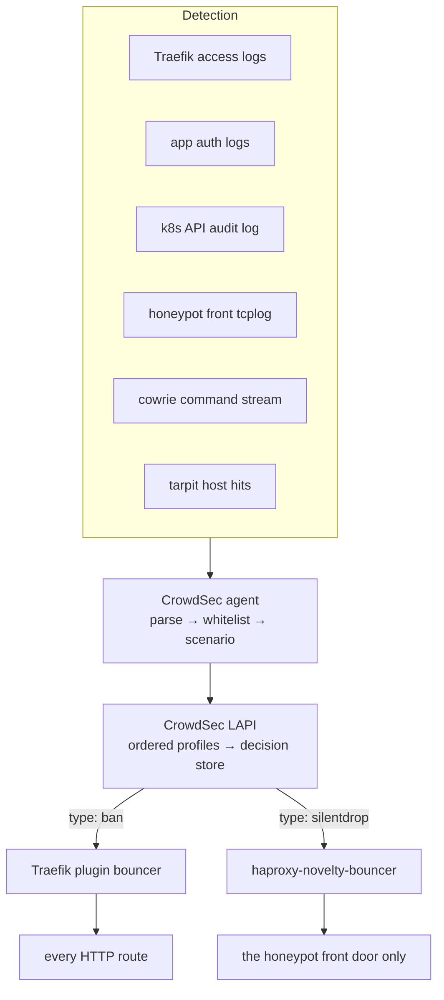

# Security stack

Four components, one loop: something watches, CrowdSec decides, and something else enforces.
The pieces are deliberately separable — **nothing that detects also blocks** — and this file
is about the joins between them. Read it before changing a scenario, a profile, or anything
that bans.

## TL;DR

- **CrowdSec is the brain.** It parses, decides and stores decisions. It enforces nothing.
- **Bouncers are the muscle**, and there are two planes, separated by **decision type**
  rather than by scenario or by source.
- `type: ban` → the Traefik plugin → HTTP services refuse the request.
- `type: silentdrop` → the honeypot's haproxy sidecar → honeypot TCP connections hang.
- **A ban deliberately does not close the honeypot.** That is the point of having two planes.
- **Falco is the backstop**: it is the only thing that can see a process execute, and its
  loudest rule is "somebody escaped the honeypot".

## The components

| Component    | What it is                                                                       | Read                                       |
| ------------ | -------------------------------------------------------------------------------- | ------------------------------------------ |
| `crowdsec/`  | Detection and decision engine, plus the Traefik-side enforcement policy          | [crowdsec/README.md](crowdsec/README.md)   |
| `honeypots/` | Two SSH/telnet traps behind one weighted, sticky TCP front                       | [honeypots/README.md](honeypots/README.md) |
| `iocaine/`   | A crawler tarpit that spends a scraper's time instead of collecting intelligence | [iocaine/README.md](iocaine/README.md)     |
| `falco/`     | Syscall-level runtime detection, including the honeypot breach tripwire          | [falco/README.md](falco/README.md)         |

Each is its own Flux Kustomization and its own namespace. Folding them into a single
namespace is a deliberate, still-gated decision — see
[\_namespace-migration/README.md](_namespace-migration/README.md) for why the folder
consolidation was safe and the namespace move is not.

## Detection, decision, enforcement



The whitelist stage runs **before any scenario sees the event**, which is what makes it a
defence against banning yourself rather than a way to un-ban yourself afterwards.

## Why two enforcement planes

A ban earned by touching the honeypot is meant to protect _everything else_. It deliberately
does not close the honeypot, because an attacker who keeps interacting keeps producing
intelligence — which is the entire reason the trap exists. A banned address can therefore
still run thousands of honeypot sessions, and that is the system working.

`silentdrop` exists for the opposite case: an attacker who has **stopped** producing
intelligence. Honeypot command traffic turned out to be cleanly bimodal. A small number of
addresses replay a near-identical payload over and over, one session per command, and account
for the overwhelming majority of all command volume; a genuine human explorer runs many
distinct commands inside a single session and is a tiny fraction of the traffic. A scenario
keyed on that shape — high volume, very low distinct-command count — catches the first
population and leaves the second alone, with a wide margin between them.

Its decision is `silentdrop`, not `ban`, so only the honeypot's own front door acts on it.
What Traefik blocks is unchanged. This separation is why a new honeypot scenario must never
be allowed to issue a second ban: two scenarios banning the same address from the same event
is a failure this stack has already had once.

## Enforcement lives outside this tree

The decision engine is here; two of the three things that act on its decisions are not.

| Enforcement point                                         | Where it is configured                                                                           | Where it runs          |
| --------------------------------------------------------- | ------------------------------------------------------------------------------------------------ | ---------------------- |
| Traefik plugin bouncer                                    | `crowdsec/bouncer-middleware.yaml` — the Middleware object is created in the `traefik` namespace | Traefik                |
| The entrypoint binding that makes that bouncer global     | `../traefik/helmrelease.yaml`                                                                    | Traefik                |
| bot-wrangler, which proxies detected bots into the tarpit | `../traefik/middlewares.yaml`, attached per route                                                | Traefik                |
| haproxy-novelty-bouncer                                   | `honeypots/haproxy.yaml`                                                                         | the honeypot front pod |

Dashboards live in `../monitoring/grafana-dashboards/`; the posture and verification suites
live in `../../../tests/security-posture/`. Neither is part of a Kustomization here, so a
change in this directory will not move them with it.

## Invariants

These are the constraints that cost something to learn. Each is enforced by a comment in the
manifest it applies to; this list is the index.

- **The bouncer's remediation status code must appear in no scenario filter.** Nine installed
  scenarios treat 403 as attack evidence, so a 403 remediation manufactures its own confirming
  evidence and renews forever. See [crowdsec/README.md](crowdsec/README.md#the-429-rule).
- **The honeypot has exactly one ban source.** Additional honeypot scenarios must land on the
  silent-drop plane or issue no decision at all.
- **Never silent-drop a LAN source.** The honeypot front carries an explicit private-range
  guard, independent of the CrowdSec whitelist, because LAN is the recovery path and must not
  depend on a decision feed being correct.
- **Never relax the private-range exclusion in the honeypot's egress rule.** Cowrie can reach
  the public web so it can capture samples; that exclusion is the only reason it cannot reach
  anything of ours.
- **subPath ConfigMap mounts are frozen at pod start.** Every config in this tree is generated
  so that an edit rolls the pod. Converting one back to a static ConfigMap means the pod runs
  stale config indefinitely and silently.
- **Record invariants here, never health.** Live state belongs in alerts and dashboards; a
  status sentence in a file like this one is wrong within a day and misleads exactly the
  person debugging an outage. Nothing in git can detect that it has gone stale.

## Operations

`task security:*` wraps `cscli` inside the LAPI pod, so these work without knowing pod names:

```sh
task security:decisions          # active bans
task security:alerts             # what triggered them
task security:bouncers           # who is enforcing, and when each last pulled
task security:metrics            # acquisition, parsers, scenarios, bouncers
task security:hub                # installed collections, parsers, scenarios
task security:honeypot-events    # recent cowrie activity by type
```

`task security:ban -- IP=…` and `task security:unban -- IP=…` issue manual decisions. Manual
decisions are deliberately not shared with the CrowdSec Console.

Two readings mislead if you do not know them: a scenario-trigger panel **includes** simulated
overflows, so an overflow there is not evidence of a ban; and simulated decisions are skipped
by both bouncers, so a decision existing is not evidence of enforcement. The procedure that
distinguishes them is
[crowdsec/docs/crowdsec-verification.md](crowdsec/docs/crowdsec-verification.md).

## Why there is no shared `security` namespace

Kubernetes namespaces are flat, so this directory is a **grouping directory**, never a
namespace. Each component owns its namespace; the grouping is the label every one of them
declares:

```yaml
app.kubernetes.io/part-of: security
```

Policy selects the group by that label rather than enumerating members, so a fifth component
inherits by being labelled.

A shared `security` namespace was scaffolded and then abandoned, because Pod Security Admission
is enforced per namespace: merging would force `privileged` for falco's eBPF driver and demote
the honeypots from `baseline`. The full reasoning, the risks that decision retires, and why HNC
was rejected are in
[`_namespace-migration/README.md`](_namespace-migration/README.md).

## Related Issues

- TALOS-hg7 — security-ops epic: tarpit, honeypot, the CrowdSec loop and its dashboards
- TALOS-y260 — operator SSO lockout; the 403 feedback loop and the allowlist pair
- TALOS-hdw8 — the silent-drop enforcement plane for honeypot replay bots
- TALOS-ic20 — consolidate the four namespaces into one `security` namespace
