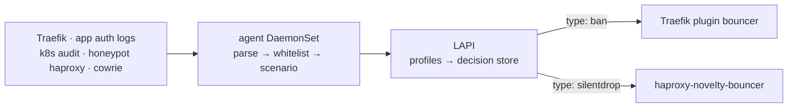

# CrowdSec — the decision engine

CrowdSec reads logs, decides, and stores decisions. **It blocks nothing itself.** Every
block in this cluster is performed by something else that pulls decisions from here — the
Traefik plugin for HTTP, the honeypot haproxy sidecar for honeypot TCP. Read
[../README.md](../README.md) for how those two planes divide, and read this file before
changing a parser, a scenario, a profile or the remediation status code.

## TL;DR

- **Detection** is the agent DaemonSet; **decision** is the LAPI; **enforcement** is elsewhere.
- The datastore is Postgres because a node-local SQLite file made LAPI rescheduling
  destructive.
- Engines authenticate with **client certificates**, so identity is fungible and survives
  reschedules; token auto-registration is off for that reason.
- The bouncer answers banned requests with **429**. This is not cosmetic — see
  [The 429 rule](#the-429-rule) below. It is the single most consequential invariant here.
- `simulation.yaml` is **inverted**. Being listed means alert-only.
- `profiles.yaml` is **ordered**. Reordering it changes what gets banned.

## Where to look

| Concern                                                               | File                                                       |
| --------------------------------------------------------------------- | ---------------------------------------------------------- |
| Engine config — parsers, scenarios, simulation, profiles, acquisition | `helmrelease.yaml`                                         |
| Traefik-side enforcement policy (lives in ns `traefik`)               | `bouncer-middleware.yaml`                                  |
| Datastore                                                             | `postgres.yaml`                                            |
| Operator-IP allowlist refresher                                       | `dynamic-allowlist.yaml`                                   |
| Third-party reputation feeds                                          | `blocklist-import.yaml`                                    |
| Identities with no boot-time re-register path                         | `machine-registrar.yaml`, `novelty-bouncer-registrar.yaml` |
| Registration-ghost reaper                                             | `machine-prune.yaml`                                       |
| Read-only decision observer for Grafana                               | `decision-exporter.yaml`                                   |
| Outbound attacker reporting                                           | `abuseipdb-reporter/`                                      |
| Local UI behind SSO                                                   | `webui.yaml`, `webui-network-policy.yaml`                  |

## The pipeline

The whitelist runs at `s02-enrich`, which is **before any scenario sees the event**. That
ordering is what makes it a defence against banning yourself rather than a way to un-ban
yourself afterwards.

## The 429 rule

**The bouncer's remediation status code must not appear in any installed scenario's filter.**

Nine installed scenarios treat 403 as attack evidence (`http-probing`,
`http-admin-interface-probing`, `http-technology-probing`, `http-wordpress-scan`,
`http-generic-403-bf` and three CVE scenarios). While the bouncer answered 403, a banned
IP received 403 for every request, and those 403s were themselves fresh evidence for the
scenario that banned it. The ban manufactured the proof of its own necessity and renewed
indefinitely. That is the mechanism behind the 2026-08-20 operator lockout from SSO.

429 matches no installed scenario filter, so a blocked request feeds nothing, the bucket
drains, and the ban expires on its own schedule. The verification command — grep every
scenario file for the status you intend to use — is recorded in `bouncer-middleware.yaml`.
Run it before changing this value, not after.

## Two allowlists, because each covers the other's failure

The operator's home address is a dynamic residential IP, and it is the address most likely
to be banned by mistake.

- The **static whitelist parser** is in git, inside the HelmRelease values. It survives a
  total loss of the decisions database, and it cannot be edited at runtime — anything that
  rewrote it would be reverted by Flux on the next reconcile.
- The **LAPI-side allowlist** (`dynamic-allowlist.yaml`) is database state, so it can be
  refreshed by a CronJob. Each run adds the current public IP with a short expiry, so a
  rotated-away address falls off by itself and the list never needs reconciling.

Keep both. The static one is the floor; the dynamic one tracks rotation.

**Imported blocklist decisions are not filtered by either parser-stage whitelist** — that
stage only suppresses locally-parsed events. `blocklist-import.yaml` therefore maintains its
own LAPI allowlist _and_ drops special-use CIDRs before import, comparing numerically rather
than by text prefix. Prefix matching cannot work here: upstream feeds aggregate adjacent
CIDRs, so a reserved block can arrive merged into a supernet whose text prefix looks
routable, and an allowlist suppresses decisions contained _within_ an entry, never supersets
of one.

## Rolling out a scenario safely

`simulation.yaml` sets `simulation: false` with an exclusion list, which **inverts** the
usual reading: a scenario named in that list is alert-only, and everything unnamed enforces.
This is the most misread file in the component.

1. Add the scenario under `config.scenarios` in the HelmRelease.
2. **Add its runtime `name:` to the `simulation.yaml` exclusions in the same commit.**
3. Soak. Simulated decisions are flagged, both bouncers skip them, and no notification is
   sent. The Grafana trigger panel _includes_ simulated overflows, so an overflow there is
   not evidence of a ban.
4. Promote by deleting the exclusion line — once it has alerted on an address that is not
   yours and has produced no operator false positives.

Several exclusions are deliberately permanent rather than pending promotion, each with its
measured reason recorded inline: rate-based `http-dos-*` scenarios catch our own tooling,
`impossible-travel` trips on operator VPN use, and `http-generic-403-bf` has a documented
history of catching only the operator. Read the comment before promoting one.

## profiles.yaml is ordered

Every profile ends with `on_success: break`, so the first matching profile claims the alert
and the rest never run. The replay-drop profile sits **above** the default IP remediation,
and that position is the only reason the cowrie replay scenario produces a `silentdrop`
instead of a second ban on an IP the honeypot scenario has already banned. Reordering the
file silently changes the enforcement plane an alert lands on.

## Identity and the datastore

**Why Postgres.** The datastore was SQLite on a node-local volume with a `Delete` reclaim
policy, so any LAPI reschedule wiped every registered machine. Agents and the Traefik
bouncer re-register from their environment on boot and recovered; AppSec registers through a
one-shot init container with no re-register path, so it crash-looped permanently on a
machine that no longer existed. Postgres makes the LAPI stateless and node-independent.
SQLite on NFS was rejected — advisory-lock flakiness corrupts the file.

**Why client certificates.** Certificate auth gives each engine a fungible, node-independent
identity, which removes the per-restart machine churn that token registration produced.
Because TLS auth is in use, token `auto_registration` is disabled: while it was on, a
registration token was injected into several pod environments and the allowed range covered
the whole pod CIDR, so anything able to read that environment could register itself as a
machine and then push fabricated alerts or delete decisions.

The crowdsec PKI is signed by the shared homelab CA, which trust-manager publishes into
every namespace as a ConfigMap. That is what lets consumers outside this namespace — the
Traefik bouncer, the web UI, the honeypot sidecar — _verify_ the LAPI certificate instead of
skipping verification, without copying a private key anywhere.

**Two identities are registered imperatively** and so have no boot-time re-register path: the
web UI's machine and the honeypot bouncer. Each has a self-healing registrar CronJob that
acts only when the identity is absent. This is not redundant with a durable database: the
key-holding parent bouncer row stops pulling once its pod IP changes, so its last-pull time
freezes and any garbage-collection window eventually reaps it.

## Acquisition is exact, not approximate

Two failure modes here are silent, and both have happened:

- **The `program:` label must match the hub parser's filter exactly**, including
  capitalisation. A mismatch means the parser never fires while everything looks healthy.
  Forgejo is deliberately absent for this reason — its log lines do not match the gitea
  parser's expected format, and wiring it up anyway would have looked like coverage while
  providing none.
- **Prefer container-pinned file sources to pod-name globs.** A glob matches every container
  in the pod, which has pulled in VPN sidecars and CNPG database logs as unparsed noise — and
  worse, it let an ingestion-stall alert stay green off the wrong container while the pipeline
  it guarded was dead.

## Observability is deliberately not enforcement

The decision exporter holds a **read-only bouncer credential of its own**, has no Kubernetes
API access and no route in, so it can be revoked or restarted without touching anything that
enforces. Sharing the Traefik fleet's key would have meant rotating every enforcing bouncer
to rotate an observer.

## Related Issues

- TALOS-pbn — CrowdSec IPS: LAPI, bouncer, AppSec, Console enrolment, k8s-audit
- TALOS-3pdz — TLS client-cert engine identity, replacing token registration
- TALOS-y260 — operator SSO lockout; the static plus dynamic allowlist pair
- TALOS-k5vm — sign the crowdsec PKI with the shared homelab CA so the LAPI cert is verifiable
- TALOS-cscw — least-privilege and fail-closed hardening pass

## What is known here

<!-- docs:gen:knowledge -->

| What is known                                                                                                               | Basis               | What would falsify it                                                                                                                               | Source                                                                            |
| --------------------------------------------------------------------------------------------------------------------------- | ------------------- | --------------------------------------------------------------------------------------------------------------------------------------------------- | --------------------------------------------------------------------------------- |
| **traefik-gc-null** — the traefik bouncer row has last_pull NULL, so the GC flush's LastPullLTE comparison never matches it | verified 2026-09-20 | last_pull becomes non-NULL, or upstream starts GC-ing never-pulled rows by created_at -- the index bouncer_last_pull_created_at already covers that | [helmrelease.yaml:479](helmrelease.yaml#L479)                                     |
| **cowrie-agents-gc-uses-api-key** — agents_autodelete reads api_key, so login_password is the ignored key                   | superseded          | n/a                                                                                                                                                 | [README.md](../../../../infrastructure/base/security/honeypots/honeyfs/README.md) |

<!-- /docs:gen:knowledge -->
