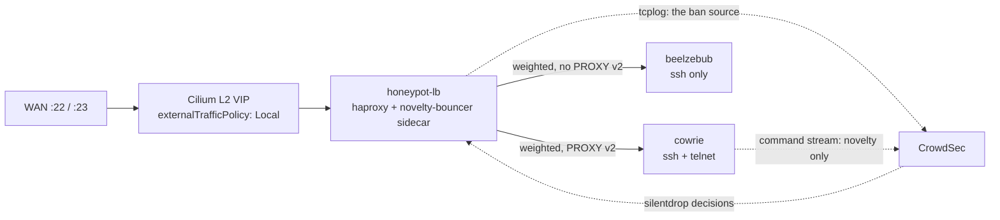

# Honeypots — cowrie and beelzebub

An SSH/telnet trap. Any connection here is a confirmed attacker: there is no legitimate
reason to reach it. Its output feeds CrowdSec, which is what turns an attacker's curiosity
into a ban everywhere else — see [../README.md](../README.md) for how that ban does _not_
close the trap.

For the exposure posture, the containment analysis and the go-live procedure, read
[cowrie-public-exposure.md](docs/cowrie-public-exposure.md).

## TL;DR

- One VIP, one haproxy front, two honeypots. The front does the weighting and the stickiness
  that a Kubernetes Service cannot.
- **The haproxy tcplog is the single ban source.** Cowrie's own log feeds only a
  non-banning novelty scenario.
- Attribute beelzebub attackers from the front's log, never from beelzebub's own source
  field — it cannot see past the proxy.
- The cage is default-deny both ways. The **exclusion of every private range** from cowrie's
  egress rule is the load-bearing control; do not relax it.
- Captured malware lives on node-local retained storage and reaches shared storage only
  through a job that mounts it read-only.
- Every config here is generated, never a static ConfigMap. See
  [Configs must roll the pod](#configs-must-roll-the-pod).

## Topology

The WAN forwards are **declared in the repo**, by an annotation on the VIP Service that the
UniFi port-forward operator reconciles. The router is not configured by hand, and the
standalone rule that used to carry this forward was removed in favour of the owning Service
declaring its own.

`externalTrafficPolicy: Local` is what preserves the real attacker address: raw TCP carries
no forwarded-for header, so a source-NAT hop would lose the only identity we have. That
setting is also why the L2 announcement is pinned to the node holding the backends — a Local
service refuses to announce from a node with no local endpoint.

## Why there is a proxy in front at all

A Kubernetes Service cannot weight its endpoints and cannot keep a client on one backend. The
front provides both:

- **Weighting** distributes new source addresses between the two honeypots at a configured
  ratio. Weighted round-robin is used rather than source hashing, whose IP-hash was lumpy
  enough on small, bursty address sets to starve one backend entirely.
- **Stickiness** keeps each attacker on the same honeypot across reconnects, so they meet a
  consistent persona rather than two different fake machines.

**PROXY v2 goes to cowrie and must never go to beelzebub.** Beelzebub serves SSH directly with
no proxy-protocol support, so a PROXY header would be fed into the SSH handshake as garbage
and every connection would fail. The consequence is by design: beelzebub logs the proxy's own
address as the source. Attribute beelzebub attackers from the front's tcplog; a dashboard
panel that filters on beelzebub's own source field returns nothing.

**Health checks target a dedicated HTTP monitor listener, never the honeypot ports.** Probing
a honeypot port opens a real proxied connection to cowrie and closes it abruptly, which
triggers an upstream cowrie traceback on every check. Tuning the backend check interval —
not the connection-close mode — is what reduced that storm by an order of magnitude; the
residual rate is the price of keeping failover.

The front is also the **only** path from the WAN to both honeypots and runs under a memory
limit, so it carries explicit socket and per-source concurrency bounds. Honeypot abuse is
sequential — the worst measured replay bot held roughly one connection at a time — so a
source holding a hundred concurrent sockets is not using the honeypot, it is trying to
exhaust it. LAN sources are exempt from every guard here, for the same reason they are exempt
from the silent-drop map: LAN is the recovery path, and it must not depend on a decision feed
being correct.

## One ban source, two log streams

Cowrie and the front both produce logs, and only one of them bans.

- **The front's tcplog** carries the real attacker address for every connection, on both
  protocols and both honeypots. It feeds the scenario that issues bans.
- **Cowrie's command stream** feeds a novelty scenario only. Its decisions are
  `silentdrop`, which the sidecar in the front consumes and the Traefik bouncer never sees.

This split exists because two scenarios once banned the same address from the same event.
The narrower cowrie parser emits only command events, and its profile is ordered above the
default remediation so it can never be turned into a second ban. If you add a honeypot
scenario, check which plane its decision lands on before merging it.

The sidecar that consumes those decisions maintains the drop map **in memory** over the
front's admin socket, so the map rebuilds from the LAPI within one poll of any restart and
there is nothing to persist. It fails open: the blast radius of an outage is "no silent-drop
at the honeypot", never a lockout.

## The cage

Default-deny in both directions, with narrow exceptions and one asymmetry that matters:

- **Cowrie may reach public 80/443 only**, with every RFC1918 range, the pod CIDR and
  link-local excepted. That is what makes "an attacker logs in and downloads their payload"
  a _capture_ rather than a foothold — the download works, and it cannot touch anything of
  ours. **The exclusion list is the load-bearing control and is mutation-tested.**
- **Beelzebub may reach the internal LLM plane only**, which is what its high-interaction
  emulation runs on.
- **Neither honeypot may reach the CrowdSec namespace.** Only the front may, and only for the
  bouncer sidecar's decision pull. The honeypots must never gain a route into the system that
  decides who is banned.
- **No Kubernetes credential is projected into any honeypot pod.** The egress policy already
  blocks the apiserver, so this is defence in depth — but a live cluster credential sitting
  inside the box we invite attackers into is exactly the thing that becomes a hole the moment
  one of the other controls is relaxed.

The namespace enforces the `baseline` Pod Security Standard. It previously enforced
`privileged`, justified by a `hostPort` binding that no longer exists now that ingress arrives
through the VIP — so the one namespace that deliberately hosts attackers had admission control
switched off on a rationale that had expired.

## Captured artifacts never touch shared storage directly

Downloaded samples and session recordings are binary; no log pipeline carries them, and on
ephemeral storage every pod restart destroyed them.

- **Node-local, retained storage, not NFS.** This volume holds live malware by design. NFS
  here is mounted by a dozen unrelated workloads; node-local keeps the samples on exactly one
  node, reachable from nothing else. The reclaim policy is `Retain` because captured samples
  are evidence, and deleting a claim must not garbage-collect them.
- **Off-node durability comes from a job, and the separation is the point.** Cowrie has no
  route to shared storage and no credential for it. The archive job mounts the capture volume
  **read-only** and is the only thing that writes to the export, so a cowrie compromise stops
  at the local volume instead of gaining write access to storage other services read.
- **Nothing executes from the archive.** It uses a dedicated storage class mounted
  `noexec,nosuid,nodev`, archives are written owner-read-only, and a plain-language warning
  is written beside them. The job also reports any captured sample carrying an execute bit —
  it cannot fix one, because the source is read-only by design, but that condition means
  cowrie's download path changed.

Treat every archive as live malware. Analyse only in an isolated VM.

## Configs must roll the pod

Every config here is produced by `configMapGenerator`, never written as a static ConfigMap.
These are mounted with `subPath`, and **a subPath mount is frozen at pod start** — kubelet
never propagates ConfigMap updates into one. With a stable ConfigMap name the pod keeps
running stale config forever, silently, while the ConfigMap in the cluster reads correctly.
That has happened here: a pod served an old backend weighting for days after the config was
changed.

The generator's hash suffix is what prevents it: editing a file changes the ConfigMap name,
which changes the pod template, which rolls the pod. Do not convert these back to static
ConfigMaps without adding a checksum annotation to each pod template.

## Cowrie specifics worth knowing before you change it

- **The image is pinned by digest.** This is the most-attacked workload in the cluster and it
  was previously on a floating tag, so every pod recreation silently fast-forwarded to
  whatever upstream last pushed. Two concrete risks, neither theoretical: cowrie's JSON log
  format moving underneath the parser that feeds the novelty scenario, and an upstream account
  compromise deploying straight into an internet-facing pod. Bump deliberately, and confirm
  command events still parse afterwards.
- **The init container that recreates cowrie's state subdirectories is load-bearing.** The
  image ships them, but mounting a volume over that path hides them and cowrie does not
  recreate them — opening a session recording then throws, the interactive shell dies, and no
  command events are logged at all. An earlier workaround repointed cowrie's paths at the
  mount root instead; that fixed logging and silently left the backup with nothing to archive
  for its entire life.
- **Probes are minimal on purpose.** The image has no shell, so exec probes are impossible,
  and the only listening ports are the honeypot ports — so every TCP probe is recorded by
  cowrie as a real session and pollutes the capture data.
- **The fake machine is fingerprint-hardened.** Stock emulated command output advertises
  hardware old enough to be a honeypot tell, so the commands botnet recon runs are overridden
  with a consistent modern profile.

## Related Issues

- TALOS-qish — consolidate both honeypots behind one VIP with a weighted sticky front
- TALOS-hdw8 — cowrie replay-bot novelty scenario and the silent-drop enforcement plane
- TALOS-cscw — hardening pass: PSA, socket bounds, health listener, digest pinning
- TALOS-3qe4 — cowrie traceback storm traced to backend health checks
- TALOS-ybtm — restore cowrie's state layout so captures and the backup both work
