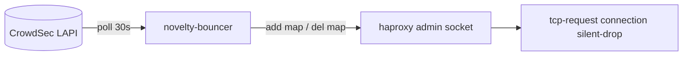

# haproxy-novelty-bouncer

> Sections between the markers below are generated from inline `doc()` and
> `diagram()` blocks in this folder. Edit the comment beside the code, not here.
> Anything OUTSIDE the markers is yours and is never touched.

## Reference

<!-- docs:gen:inline-docs -->

### Overview

#### What this sidecar does 

Polls the CrowdSec LAPI for `silentdrop` decisions and maintains haproxy's replay.map
over the admin socket with `add map` / `del map`. The map lives ONLY in haproxy's memory,
so a haproxy restart empties it until the next reconcile — there is no file on disk.

source: [bouncer.py:3](bouncer.py)

#### Decision path 

source: [bouncer.py:10](bouncer.py)

<!-- /docs:gen:inline-docs -->
