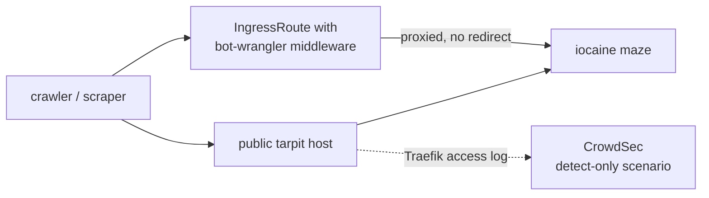

# iocaine — the crawler tarpit

A tarpit, not a honeypot. Where the [honeypots](../honeypots/README.md) collect intelligence
about an attacker, iocaine spends a scraper's time and money: it serves an endless,
procedurally generated maze of plausible-looking garbage so that crawling it costs the
crawler and poisons whatever it was collecting.

## TL;DR

- Two ways in: a **direct hit on the public tarpit host**, or the **bot-wrangler Traefik
  middleware** transparently proxying a detected bot into the maze without a redirect.
- bot-wrangler is attached **per route**, not on an entrypoint — a bot-detection heuristic
  bound globally would eventually mis-serve a real client on every route at once.
- Configuration is **KDL, not TOML**, and that is not a style choice.
- Detection of tarpit hits is a CrowdSec scenario that lives in
  [../crowdsec/](../crowdsec/README.md), not here.
- A `421` to an ordinary browser is the handler working, not a broken ingress.

## How traffic arrives

The network policy admits **only Traefik** to the maze, so both paths arrive through the
ingress and nothing else in the cluster can reach it. Egress is DNS only.

The bundled handler answers ordinary browser user agents differently from recognised
crawlers. A `421` from a browser is therefore evidence that the handler is working — not
that Cloudflare or the ingress has failed. Diagnose a suspected outage with a crawler user
agent.

Reaching the tarpit host is itself a confirmed-bot signal, and CrowdSec has a scenario for
it. That scenario, and whether it bans or merely alerts, is configured in the CrowdSec
HelmRelease — see [../crowdsec/README.md](../crowdsec/README.md#rolling-out-a-scenario-safely)
before changing it. Nothing in this directory decides enforcement.

## Why KDL

iocaine 3.x made KDL its native configuration language and removed the older TOML generator
sections outright — the templates generate that content now. The handler and source schema
used here has a documented, verified KDL form and no verified TOML equivalent, so shipping
`.toml` would have meant guessing at an unverified shape. Every published 3.x deployment,
including the image's own default, uses KDL.

The deployment overrides the image's entrypoint to point at a **different** config directory
than the one baked into the image. That is deliberate: it stops the image's default bind
configuration from loading, so the listener declared here is the only one. Pointing the
config path at the image's own directory would quietly add a second listener.

## Why a corpus ConfigMap exists at all

iocaine is fully functional with no configuration and ships an embedded public-domain corpus.
The corpus here is not a fix for anything — it exists so that **this** install's generated
garbage is unique rather than byte-identical to every other default install, which would make
the maze trivially fingerprintable. The text is public domain; swapping in a larger book
makes for richer garbage and changes nothing else.

## Related Issues

- TALOS-mko — iocaine tarpit and the bot-wrangler proxying middleware
